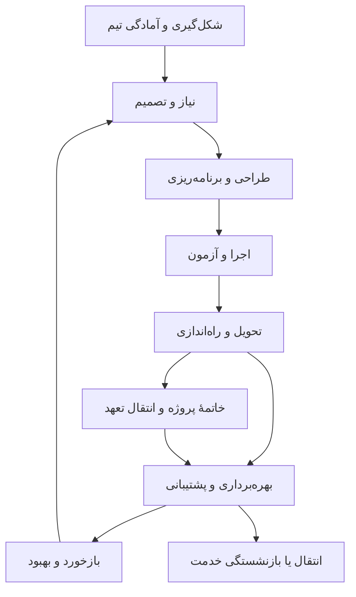

# سند زندهٔ سامانهٔ جامع کار تیمی، پروژه و عملیات مستمر

**نسخهٔ محتوایی:** ۰٫۵ — انتقال به ریپو؛ حذف فرض محصول موجود؛ تصمیم‌ها در `decisions.md` و دامنهٔ پیشنهادی در `scope-proposal.md`  
**تاریخ تهیه و بررسی منابع:** ۲۰۲۶/۰۹/۲۷  
**وضعیت:** در حال تکمیل؛ پیشنهاد محصول، بدون تعهد به ساخت یا ترتیب پیاده‌سازی  
**نقطهٔ شروع:** محصول قبلی وجود ندارد؛ ساخت از صفر است (تصمیم D-01 در `decisions.md`).

## ۱. هدف و مبنای این سند

این سند مرجع مشترک برای تصمیم‌گیری دربارهٔ قابلیت‌هایی است که می‌توان به محصول اضافه کرد. دامنه از شکل‌گیری تیم و تعیین مأموریت، تا دریافت نیاز، طراحی، برنامه‌ریزی، ساخت، تحویل، عملیات روزمره، پشتیبانی و بهبود ادامه دارد. پیشنهادهای قبلی حفظ شده‌اند؛ نسخهٔ ۰٫۳ علاوه بر افزودن قابلیت، رابطهٔ پروژه با محصول، خدمت و مسئولیت دائمی تیم را بازنگری می‌کند. سند، بک‌لاگ اجرایی یا مشخصات نهایی نرم‌افزار نیست.

### خواسته‌های تأییدشدهٔ صاحب محصول

- قابلیت استفاده برای تیم‌های نرم‌افزار، انرژی، نیروگاه و حوزه‌های دیگر.
- دید کلی، آنی و جامع از وضعیت واقعی کارها.
- امکانات کافی برای مدیر پروژه، مدیر محصول و افراد مرتبط با اجرا.
- استفادهٔ روزانهٔ ساده برای مجری کار.
- پیش‌فرض کاربردی همراه با شخصی‌سازی گسترده.
- افزایش قابل‌اندازه‌گیری بهره‌وری.
- بررسی سامانه‌های مکمل، به‌ویژه DMS کامل.
- تمرکز فعلی بر کشف و طبقه‌بندی قابلیت‌ها؛ تصمیم دربارهٔ نسخهٔ اول در مرحلهٔ بعد.
- تمام قابلیت‌های مرتبط و قابل‌تصور در فهرست بررسی ثبت شوند؛ هزینه، پیچیدگی، بزرگی محصول یا محدودیت نسخهٔ اول دلیل کنارگذاشتن قابلیت در این مرحله نیست.
- ساخت داخلی، یکپارچه‌سازی و استفاده از مؤلفهٔ تخصصی گزینه‌های باز هستند؛ پیشنهاد اتصال نباید موجب حذف یک قابلیت از دامنهٔ بررسی شود.
- سامانه کل چرخهٔ همکاری تیم، از اولین قدم تا پشتیبانی و بهبود مستمر را پوشش دهد؛ عملیات روزمره نباید برای استفاده از محصول به پروژهٔ موقت تبدیل شود.
- تمام واحدهای یک شرکت، از جمله مالی، منابع انسانی، فنی، فروش و عملیات، کاربر محصول هستند؛ اهداف، کار، درخواست، سند، تأیید و همکاری آن‌ها باید پوشش داده شود.
- ثبت سند حسابداری و عملیات تخصصی مشابه، دامنهٔ ساخت موتور مالی این محصول نیست؛ درخواست، مدارک، تأیید، موعد و پیگیری نتیجهٔ همان فعالیت‌ها در محصول مدیریت می‌شود و نتیجهٔ تخصصی می‌تواند از سامانهٔ مالی دریافت شود.

### قاعدهٔ دامنه

این سند کاتالوگ ظرفیت نهایی محصول است. کشف قابلیت، انتخاب قابلیت برای ساخت، روش تأمین و زمان‌بندی چهار تصمیم جدا هستند. فعلاً کار اصلی کشف و تشریح است. کاربردپذیری همچنان خواستهٔ صاحب محصول است، اما از آن برای کوچک‌کردن فهرست امکانات استفاده نمی‌کنیم. نمایش نقش‌محور و شخصی‌سازی، تصمیم طراحی تجربه‌اند و سقف قابلیت ایجاد نمی‌کنند.

فهرست باز و قابل‌گسترش است؛ «تمام قابلیت‌ها» هدف پوشش جامع دارد و ادعای اتمام قطعی کشف نیازها نیست. ترجیح قبلی دربارهٔ نداشتن چت بسیار مفصل ثبت است؛ با دستور جدید، گزینه‌های ارتباطی هم در فهرست کامل می‌مانند و انتخاب آن‌ها بعداً انجام می‌شود.

«انجام کار درون سامانه» یعنی آغاز، هماهنگی، اجرای دیجیتالِ ممکن، تصمیم، شواهد و پیگیری در فضای واحد در دسترس باشد. فعالیت فیزیکی در محل انجام می‌شود و شواهدش به سامانه برمی‌گردد. برای ابزار تخصصی هم گزینهٔ اجرای داخلی، تعبیه‌شده و اتصال برقرار است؛ نوع تأمین هنوز تعیین نشده است.

### اصل بازنگری نسخهٔ ۰٫۳: چرخه‌های مستقل اما متصل

| موجودیت | چرخه و مسئولیت | رابطهٔ لازم |
|---|---|---|
| تیم | شکل‌گیری، جذب، همکاری، رشد، تغییر ساختار و انتقال مالکیت | می‌تواند چند پروژه و چند خدمت دائمی داشته باشد. |
| پروژه | شروع و پایان مشخص برای ایجاد تغییر یا خروجی | خروجی را به محصول/خدمت/دارایی و مسئول بهره‌برداری تحویل می‌دهد. |
| محصول | مسئله، ایده، نسخه‌های متوالی، استفاده، بهبود و بازنشستگی | ممکن است از چند پروژه ساخته شود و هم‌زمان در حال توسعه و پشتیبانی باشد. |
| خدمت | عرضه، مصرف، سطح خدمت، پشتیبانی و بهبود | به مالک، کاربران، دارایی‌ها، قرارداد و تیم پاسخ‌گو وصل است؛ به پروژهٔ باز وابسته نیست. |
| دارایی یا تجهیز | تأمین، نصب، استفاده، تعمیر، جابه‌جایی و خروج از مدار | سابقهٔ پروژه‌ها، نسخه/پیکربندی، تعمیر و هزینه را حفظ می‌کند. |
| مشتری و قرارداد | شروع رابطه، تعهد، استفاده، تمدید و خاتمه | حق دریافت خدمت، سطح پشتیبانی و تحویل‌ها را مشخص می‌کند. |

پشتیبانی می‌تواند بدون تاریخ پایان از پیش تعیین‌شده ادامه یابد. اگر محصول، خدمت یا قرارداد متوقف شد، مسیر انتقال و خاتمهٔ کنترل‌شده لازم است. بستن پروژه نه تیکت‌ها را می‌بندد، نه مالک خدمت یا تعهدهای مشتری را حذف می‌کند.

### فرضیه‌های طراحی، هنوز نیازمند اعتبارسنجی

- هستهٔ مشترک با بسته‌های تخصصی قابل‌فعال‌سازی، از نمایش همهٔ قابلیت‌ها به همهٔ کاربران مناسب‌تر است.
- اتصال کار، سند، تصمیم، تأیید و منابع می‌تواند ارزش محوری محصول باشد.
- ورود اطلاعات یک‌باره و استفادهٔ مجدد در چند بخش، برای سادگی تجربه ضروری است.
- هر قابلیت فهرست‌شده باید با مشتری واقعی اعتبارسنجی شود؛ وجود در فهرست به معنی ضرورت برای همهٔ مشتریان نیست.
- برای هیچ پیشنهاد این سند، ادعای «اولین در جهان» یا نبودن در تمام رقبا نداریم.

### روش مطالعه و نگهداری

شناسه‌هایی مانند `GOV-03` و `DMS-07` ثابت می‌مانند. در نسخه‌های بعدی شناسه‌ها دوباره استفاده یا از نو شماره‌گذاری نشوند؛ قابلیت حذف‌شده با وضعیت «کنارگذاشته‌شده» و دلیل حفظ شود.

**نوع نیاز:** «پایه» برای مدیریت کار عمومی؛ «حرفه‌ای» برای مدیریت پروژهٔ پیشرفته؛ «تخصصی» برای بسته‌های حوزه‌ای؛ «فرضیه» برای فرصت تمایز. این برچسب‌ها اولویت زمانی نیستند.

**وضعیت فعلی تمام قابلیت‌ها:** پیشنهاد برای بررسی؛ وضعیت موجود در محصول، هزینهٔ ساخت، اولویت و مسئول اجرا تعیین نشده است. زیرقابلیت‌های DMS زیرمجموعهٔ `DOC-01` هستند و نباید دوباره به‌عنوان ماژول مستقل شمرده شوند.

**استثنای دامنه در نسخهٔ ۰٫۴:** موتور تخصصی حسابداری و محاسبهٔ حقوق در BIZ-03 و BIZ-04 با حفظ سابقه، خارج از دامنهٔ جاری علامت خورده‌اند. مدیریت کارهای مالی، جمع‌آوری و تأیید داده، پیگیری و اتصال به نتیجهٔ تخصصی در دامنه باقی است. حذف هزینه یا پیچیدگی دلیل این تغییر نیست؛ این مرز طبق توضیح صاحب محصول است.

## ۲. تیم از اولین قدم تا پشتیبانی مستمر چه نیازهایی دارد؟

چارچوب APM موضوعاتی مانند توجیه، حاکمیت، نیازمندی، منابع، هزینه، قرارداد، تغییر، انتقال و منافع را پوشش می‌دهد. دسته‌بندی زیر برداشت طراحی محصول ما با الهام از این دامنه است؛ ادعای انطباق رسمی با یک استاندارد ندارد. [S01]

| مرحله | سؤال تیم یا مسئول مربوط | ابزارها و خروجی‌های موردنیاز | شناسه‌های مرتبط |
|---|---|---|---|
| شکل‌گیری تیم | برای چه هدفی و با چه اختیار و منابعی کنار هم هستیم؟ | منشور تیم، مالکیت‌ها، توافق کاری، جذب و ابزار شروع | GOV-08 تا GOV-10، PPL-07، PPL-02 |
| آماده‌سازی همکاری | افراد، دسترسی، دانش، بودجه و روال انجام کار آماده‌اند؟ | نقش، آموزش، تجهیزات، دسترسی، قواعد ارتباط و فرایندهای مشترک | PPL، PLT، BIZ، COL |
| بررسی اولیه | آیا این پروژه ارزش انجام‌دادن دارد؟ | نیاز اولیه، گزینه‌ها، امکان‌سنجی، هزینه و منفعت تخمینی، ظرفیت و ریسک | GOV-01، GOV-02، REP-03 |
| تصویب و شروع | چه کسی اختیار، بودجه و مسئولیت می‌دهد؟ | منشور، حامی، حدود اختیار، ذی‌نفعان، مسئولیت‌ها و تصمیم شروع | GOV-03 تا GOV-06 |
| تعریف کار | دقیقاً چه چیزی باید تحویل شود و چه چیزی خارج از تعهد است؟ | نیازمندی، محدوده، ساختار شکست کار، معیار پذیرش و ردیابی | SCP-01 تا SCP-04 |
| طراحی و انتخاب راه‌حل | کدام راه‌حل مسئله را حل می‌کند و چگونه بازبینی می‌شود؟ | مقایسهٔ گزینه، نمونهٔ اولیه، طرح، بازبینی و تصمیم طراحی | REL-01، REL-02، DOM-09 |
| برنامه‌ریزی | چه کسی، چه زمانی، با چه هزینه و منابعی انجام می‌دهد؟ | زمان‌بندی، برآورد، ظرفیت، بودجه، کیفیت و برنامهٔ یکپارچه | PLN، RES، FIN، CTL-06 |
| تأمین و آماده‌سازی | آیا نفر، تجهیز، سند، مجوز و خرید لازم آماده است؟ | برنامهٔ تأمین، قرارداد، رزرو منابع، نسخهٔ معتبر سند و آمادگی شروع | SUP، DOC-01، RES، INN-01 |
| اجرا و هماهنگی | چه کاری جلو می‌رود و چه چیزی باید حل شود؟ | کار، تصمیم، ارتباط، تأیید، رفع مانع و تحویل بین واحدها | WRK، COL، CTL-02 |
| کنترل و اصلاح | آیا هنوز روی برنامه‌ایم؟ چه تغییری باید تصویب شود؟ | خط مبنا، انحراف، پیش‌بینی، ریسک، تغییر و اقدام اصلاحی | CTL، REP، FIN-03، PLN-05 |
| پذیرش و راه‌اندازی | آیا خروجی قابل‌قبول و آمادهٔ استفاده است؟ | آزمون، شواهد پذیرش، فهرست نواقص، آموزش و برنامهٔ انتقال | SCP-04، END-01، END-02 |
| تثبیت پس از تحویل | خروجی در استفادهٔ واقعی پایدار و قابل‌پشتیبانی است؟ | کنترل اولیه، مسئول پاسخ، برنامهٔ برگشت و پذیرش عملیات | REL-07، REL-08، OPS-01، OPS-02 |
| خاتمه | چه تعهد یا مسئولیتی هنوز باقی است؟ | تسویه، انتقال موارد باز، آزادسازی منابع و بستهٔ بایگانی | END-03، END-04 |
| بهره‌برداری مستمر | امروز چه خدمت و کار روتینی باید درست انجام شود؟ | خدمت، دستورالعمل اجرایی، پایش، نگهداری و ظرفیت | OPS، WRK-08، DOM-03 |
| پشتیبانی و رفع اختلال | چه کسی مشکل دارد، چه تعهدی داریم و چه کسی پاسخ می‌دهد؟ | صف پشتیبانی، قرارداد، سطح خدمت، کشیک و رخداد | WRK-06، OPS-02 تا OPS-05، DOM-08 |
| بهبود و توسعهٔ بعدی | کدام مشکل تکراری یا نیاز جدید باید به تغییر تبدیل شود؟ | مسئلهٔ ریشه‌ای، بازخورد، تصمیم اولویت و انتشار بعدی | OPS-05، OPS-14، DOM-01، REL |
| پس از تحویل | آیا نتیجه‌ای که برایش هزینه کردیم حاصل شد؟ | مالک منفعت، شاخص نتیجه، بازبینی و درس‌آموخته‌ها | END-05، DOC-03، REP-04 |
| انتقال یا توقف خدمت | چه چیزی باید به تیم/محصول دیگر منتقل یا خاتمه یابد؟ | مهاجرت، اطلاع مشتری، بستن تعهد، داده و آرشیو | END-06، PPL-08، OPS-01 |

این مسیر الزاماً خطی نیست. تیم‌های چابک یا ترکیبی می‌توانند برنامه‌ریزی، اجرا و پذیرش را به‌صورت تکرارشونده انجام دهند. هر مرحله باید متناسب با اندازه و ریسک پروژه ساده یا رسمی شود. [S02]

پروژهٔ جدید، توسعهٔ محصول موجود، پشتیبانی، فرایند تکرارشونده و پروندهٔ موردی پنج شکل کار قابل‌پشتیبانی‌اند؛ هیچ‌کدام نباید برای ورود به سامانه مجبور به تقلید کامل از دیگری شود.

### خروجی بازنگری شکاف‌ها در نسخهٔ ۰٫۳

| شکاف نسخهٔ قبل | اصلاح این نسخه | نتیجهٔ طراحی |
|---|---|---|
| شروع از پروژه و اعضای حاضر | منشور تیم، توافق همکاری، جذب و تداوم نقش | شروع استفاده پیش از اولین پروژه ممکن می‌شود. |
| فعالیت تخصصی در یک عنوان کلی | طراحی، محیط کار، بازبینی، آزمون، بسته و عرضه | مسیر تولید خروجی واقعی قابل‌ردیابی می‌شود. |
| پشتیبانی در قالب تیکت و ضمانت | خدمت، مالک، قرارداد، نسخهٔ نصب‌شده و کیفیت | پشتیبانی مدل دائمی و مستقل پیدا می‌کند. |
| رخداد و مشکل ریشه‌ای نزدیک به هم | مسیر جدا برای بازگرداندن خدمت و حذف علت | راه‌حل موقت به‌اشتباه حل دائمی محسوب نمی‌شود. |
| کار روزمره تابع پروژه | روال تکراری، پرونده و خدمت مستقل | واحد اداری/عملیاتی بدون پروژهٔ ساختگی کار می‌کند. |
| ظرفیت صرفاً برای پروژه | ظرفیت توسعه، کشیک، پشتیبانی و تقاضای ناگهانی | وعدهٔ پروژه با واقعیت عملیات سنجیده می‌شود. |
| پایان در تحویل | تثبیت، پذیرش عملیات، بهبود و بازنشستگی | مالکیت و تعهد پس از تحویل باقی می‌ماند. |

این جدول تحلیل ما از سند قبلی است، نه ادعای ضعف همهٔ رقبا. هیچ مورد قبلی به دلیل بزرگی دامنه حذف نشده است.

## ۳. فهرست اصلی قابلیت‌ها

### ۳.۱. شکل‌گیری، تصویب و راهبری پروژه — GOV

این خانواده در فهرست قبلی کم‌رنگ بود. توجیه پروژه باید گزینه‌ها، هزینه، منفعت و ریسک را کنار هم قرار دهد؛ تصویب اولیه نیز پایان بررسی ارزش ادامهٔ پروژه نیست. [S03]

| شناسه | ابزار / سامانه | دامنهٔ پیشنهادی و ارزش عملی | نوع |
|---|---|---|---|
| GOV-01 | ورودی و ارزیابی پیشنهاد پروژه | ثبت نیاز و درخواست پروژه، دسته‌بندی، جلوگیری از تکرار، امتیازدهی قابل‌توضیح، بررسی ظرفیت و مسیر تأیید؛ از پراکندگی ایده‌ها جلوگیری می‌کند. | حرفه‌ای |
| GOV-02 | توجیه و امکان‌سنجی | بیان مسئله، گزینه‌های راه‌حل و گزینهٔ عدم اقدام، هزینه و منفعت تخمینی، فرضیات، محدودیت‌ها و ریسک؛ مقایسهٔ ساخت، خرید یا برون‌سپاری. | حرفه‌ای |
| GOV-03 | منشور و شناسنامهٔ پروژه | هدف، حامی، مدیر، بودجهٔ اولیه، محدودهٔ کلان، نقاط تحویل، معیار موفقیت و اختیار مدیر؛ همراه با تصویب و تاریخچه. | حرفه‌ای |
| GOV-04 | ذی‌نفعان و برنامهٔ ارتباط | اشخاص و گروه‌ها، نیاز اطلاعاتی، میزان اثرگذاری، دغدغه، مسئول ارتباط و تناوب اطلاع‌رسانی؛ اطلاعات حساس با دسترسی محدود. | حرفه‌ای |
| GOV-05 | مسئولیت و اختیار تصمیم | ماتریس RACI ساده، مسئول پاسخ‌گو، تصمیم‌گیر، مشاور و مطلع برای کار یا خروجی؛ جانشینی، تفویض و مسیر حل اختلاف. | حرفه‌ای |
| GOV-06 | دروازه‌های تصمیم و کنترل مرحله | چک‌لیست مدارک و شرایط عبور، کمیتهٔ تصمیم، تصویب ادامه، توقف، تعلیق یا تغییر؛ صورت تصمیم و تعهدهای بعدی. | حرفه‌ای |
| GOV-07 | برنامه‌ریزی راهبرد و انتخاب سرمایه‌گذاری | نقشهٔ اهداف، سناریوهای تخصیص بودجه، وابستگی ابتکارها و مقایسهٔ ارزش/ریسک/ظرفیت؛ شفافیت دلیل شروع و توقف پروژه‌ها و ثبت تصمیم کمیته. | حرفه‌ای |
| GOV-08 | منشور و راه‌اندازی تیم | مأموریت، کاربران/مشتریان تیم، خروجی و خدمت، حامی، اختیار، منابع اولیه و معیار موفقیت؛ قابل‌استفاده پیش از تعریف اولین پروژه. | پایه |
| GOV-09 | توافق‌های کاری و مدل همکاری | ساعات هم‌پوشان، روش تصمیم، جلسات، قواعد ارتباط و ارجاع، تعریف آماده/تمام و بازبینی دوره‌ای توافق؛ پذیرش و تغییر قواعد ثبت شود. | پایه |
| GOV-10 | مالکیت فرایند و مرز تیم‌ها | نقشهٔ فرایند، ورودی/خروجی هر تیم، مالک فرایند، مسئول پاسخ و تعهد بین واحدها؛ خلا و تعارض مالکیت قابل‌پیگیری شود. | حرفه‌ای |

### ۳.۲. نیازمندی، محدوده و خروجی — SCP

| شناسه | ابزار / سامانه | دامنهٔ پیشنهادی و ارزش عملی | نوع |
|---|---|---|---|
| SCP-01 | مدیریت نیازمندی | ثبت منبع نیاز، مالک، دلیل، اولویت، نسخه، وضعیت و تعارض؛ نیاز مشتری یا استاندارد داخلی به کارهای اجرایی قابل‌ردیابی شود. | حرفه‌ای |
| SCP-02 | محدوده و ساختار شکست کار | داخل و خارج از محدوده، خروجی‌ها، WBS و تعریف بستهٔ کاری؛ شکستن پروژه بر اساس تحویل‌ها، نه فقط فهرست فعالیت. | حرفه‌ای |
| SCP-03 | ماتریس ردیابی | اتصال نیازمندی به خروجی، کار، سند، آزمون و تأیید؛ کشف نیاز بدون کار و کار بدون توجیه روشن. | حرفه‌ای |
| SCP-04 | معیار پذیرش و دفتر تحویل‌ها | تعریف خروجی قابل‌قبول، تأییدکننده، روش سنجش و شواهد لازم از ابتدا؛ تفاوت اتمام فعالیت با پذیرش خروجی حفظ شود. | پایه |

### ۳.۳. برنامه‌ریزی زمان و برنامهٔ یکپارچه — PLN

| شناسه | ابزار / سامانه | دامنهٔ پیشنهادی و ارزش عملی | نوع |
|---|---|---|---|
| PLN-01 | برآورد و مبنای برآورد | زمان، تلاش، هزینه یا مقدار کار؛ ثبت روش، فرض، بازهٔ عدم قطعیت و تاریخ برآورد؛ مقایسه با واقعی برای بهبود تخمین‌های آینده. | حرفه‌ای |
| PLN-02 | زمان‌بندی و شبکهٔ وابستگی | مایلستون، انواع رابطهٔ شروع/پایان، فاصلهٔ زمانی، تقویم، محدودیت، مسیر بحرانی و شناوری؛ جابه‌جایی تاریخ‌ها با توضیح اثر. | حرفه‌ای |
| PLN-03 | برنامهٔ یکپارچه و خط مبنا | نسخهٔ مصوب محدوده، زمان و هزینه؛ برنامهٔ فعلی و واقعی کنار مبنا دیده شوند؛ مبنای اولیه با تغییر برنامه پاک نشود. | حرفه‌ای |
| PLN-04 | برنامهٔ کوتاه‌مدت و تعهد اجرا | برنامهٔ هفته یا اسپرینت، آماده‌سازی کارهای آینده، توافق تعهد، سقف کار هم‌زمان و بازبینی انجام تعهد. | پایه |
| PLN-05 | سناریو و برنامهٔ جبرانی | نسخهٔ آزمایشی برنامه برای تغییر ظرفیت، تأخیر تأمین یا اولویت؛ مقایسهٔ سناریو با مبنا قبل از اعمال. | حرفه‌ای |
| PLN-06 | تحلیل کمی عدم قطعیت | برآورد سه‌نقطه‌ای، توزیع مدت/هزینه، شبیه‌سازی و بازهٔ احتمال اتمام؛ فرضیات و حساسیت نتیجه به ورودی‌ها دیده شود. | حرفه‌ای |
| PLN-07 | برنامه‌ریزی چندروش و چندمقیاس | کار تکرارشونده، برنامهٔ خطی/مکانی، برنامهٔ کلان و جزئی، زنجیرهٔ بحرانی و بافر در صورت نیاز؛ استفادهٔ ترکیبی از رویکرد چابک و پیش‌بینی‌پذیر در یک سبد. | تخصصی |

مسیر بحرانی، خط مبنا و تسطیح منابع قابلیت‌های شناخته‌شده در ابزارهای برنامه‌ریزی هستند؛ Primavera و Smartsheet مرجع بررسی این بخش‌اند. [S12، S13]

### ۳.۴. افراد، ظرفیت و منابع — RES

| شناسه | ابزار / سامانه | دامنهٔ پیشنهادی و ارزش عملی | نوع |
|---|---|---|---|
| RES-01 | تقویم و ظرفیت | ساعات کاری، تعطیلات، مرخصی از منبع معتبر، شیفت و ظرفیت قابل‌تخصیص؛ نمایش هم‌پوشانی تعهدات چند پروژه. | پایه |
| RES-02 | تخصیص و رزرو منابع | درخواست نفر یا نقش، تخصیص موقت و قطعی، رزرو تجهیز/محل، حل تعارض و تسطیح با پیش‌نمایش اثر روی برنامه. | حرفه‌ای |
| RES-03 | مهارت و آمادگی تیم | مهارت، صلاحیت لازم، آموزش موردنیاز، جایگزین و تاریخ اعتبار گواهی در حوزه‌های مرتبط؛ کمک به تخصیص مناسب. | تخصصی |
| RES-04 | زمان واقعی و تایم‌شیت | ثبت دستی یا تایمر اختیاری، زمان قابل‌صورتحساب، تأیید و اصلاح ثبت‌شده؛ مقایسهٔ تلاش واقعی با تخمین، بدون اجبار به زمان‌سنجی برای همه. | حرفه‌ای |
| RES-05 | ظرفیت مشترک توسعه و پشتیبانی | ذخیرهٔ ظرفیت برای تقاضای پیش‌بینی‌نشده، کشیک و نگهداری؛ اثر رخداد و کار فوری روی تعهد پروژه و زمان بازیابی ظرفیت دیده شود. | حرفه‌ای |

### ۳.۵. بودجه، هزینه و کنترل مالی پروژه — FIN

| شناسه | ابزار / سامانه | دامنهٔ پیشنهادی و ارزش عملی | نوع |
|---|---|---|---|
| FIN-01 | ساختار هزینه و بودجه | بودجه بر اساس بستهٔ کاری/دستهٔ هزینه، ذخیرهٔ احتیاطی، تصویب، نسخه و اختیار مصرف؛ ثبت ارز و نرخ مبنای تبدیل. | حرفه‌ای |
| FIN-02 | هزینهٔ واقعی و تعهدشده | نیروی انسانی، خرید، پیمانکار و سایر هزینه‌ها؛ تفکیک هزینهٔ ثبت‌شده از سفارش یا تعهد پرداخت، اتصال به سیستم مالی و جلوگیری از دوباره‌شماری. | حرفه‌ای |
| FIN-03 | پیش‌بینی هزینهٔ نهایی | هزینهٔ باقی‌مانده و نهایی، انحراف از بودجه و سناریو؛ EVM فقط برای پروژه‌ای که مبنا، هزینهٔ واقعی و روش سنجش پیشرفت معتبر دارد. | حرفه‌ای |
| FIN-04 | پرداخت و جریان نقد پروژه | صورت‌وضعیت، پرداخت مرحله‌ای، مهلت پرداخت، ورودی و خروجی پیش‌بینی‌شده و مدارک لازم؛ همگام با سامانهٔ مالی. | تخصصی |
| FIN-05 | هزینهٔ چرخهٔ عمر و عملیات | بودجهٔ تکرارشونده، هزینهٔ پشتیبانی، میزبانی، لایسنس، نگهداری و هزینهٔ هر خدمت/مشتری؛ هزینهٔ تغییر پروژه از هزینهٔ ادامهٔ خدمت جدا و قابل‌تجمیع باشد. | حرفه‌ای |

این خانواده کنترل مالی پروژه را پوشش می‌دهد. تیم مالی علاوه بر آن، اهداف، تقویم کار، درخواست پرداخت، جمع‌آوری مدارک، تأییدها، پیگیری مطالبات و آماده‌سازی گزارش را با امکانات مشترک انجام می‌دهد. موتور ثبت سند حسابداری و محاسبات تخصصی مالی در دامنهٔ جاری ساخت نیست؛ در صورت نیاز مرجع، شماره، وضعیت و نتیجهٔ عملیات از سامانهٔ مالی متصل دریافت می‌شود.

### ۳.۶. خرید، پیمانکار و تعهدات قرارداد — SUP

| شناسه | ابزار / سامانه | دامنهٔ پیشنهادی و ارزش عملی | نوع |
|---|---|---|---|
| SUP-01 | برنامه و درخواست تأمین | اقلام و خدمات لازم، تاریخ نیاز، زمان تأمین، مسئول و وابستگی به کار؛ درخواست خرید با تأیید و پیگیری وضعیت. | حرفه‌ای |
| SUP-02 | ارزیابی پیشنهاد تأمین‌کننده | درخواست پیشنهاد، مقایسهٔ قیمت، زمان، کیفیت و شرایط؛ ثبت دلیل انتخاب و تأیید، با اتصال به سامانهٔ خرید موجود. | تخصصی |
| SUP-03 | قرارداد و تعهدات | دامنهٔ قرارداد، خروجی، موعد، شروط پذیرش، تغییر سفارش، تضامین و هشدار سررسید؛ پیوند به سند اصلی و مالک تعهد. | تخصصی |
| SUP-04 | عملکرد پیمانکار و ادعاها | وضعیت تحویل، نقص، تأخیر، مکاتبه و شواهد ادعای تغییر زمان/هزینه؛ روند رسیدگی و تصمیم ثبت شود. | تخصصی |

### ۳.۷. انجام کار و مدیریت درخواست — WRK

| شناسه | ابزار / سامانه | دامنهٔ پیشنهادی و ارزش عملی | نوع |
|---|---|---|---|
| WRK-01 | نوع کار و گردش‌کار | تسک، باگ، درخواست، دستورکار و نوع سفارشی؛ فیلد، مراحل، انتقال مجاز و شرط تکمیل متناسب با نوع کار. | پایه |
| WRK-02 | ساختار، تکرار و وابستگی کار | زیرکار، چک‌لیست، ارتباط بین پروژه‌ها، مانع، الگو و تکرار با تقویم؛ جلوگیری از تکثیر یک کار در چند محل. | پایه |
| WRK-03 | نما و عملیات سریع | لیست، جدول، کانبان، تقویم، تایم‌لاین و گانت از همان داده؛ فیلتر ذخیره‌شده، ویرایش گروهی، میان‌بر و جست‌وجوی سریع. | پایه |
| WRK-04 | میزکار شخصی و تمرکز | کارهای قابل‌انجام، امروز، منتظر پاسخ و تأیید، برنامهٔ روز، ثبت سریع «شروع»، «مانع» و «تحویل» با حداقل ورودی. | پایه |
| WRK-05 | فرم‌ساز و ورودی درخواست | فرم عمومی/داخلی، منطق شرطی، فایل و ارجاع؛ تبدیل درخواست به کار یا پروژه با حفظ درخواست‌کننده و سابقه. | پایه |
| WRK-06 | مرکز خدمات و صف رسیدگی | دسته‌بندی، اولویت، مسئول صف، SLA با تقویم و قواعد توقف ساعت، تشخیص درخواست تکراری و ارجاع؛ قابل‌فعال‌سازی برای تیم خدمات. | تخصصی |
| WRK-07 | پرونده و کار موردی | پروندهٔ مشتری/اداری/فنی با چند کار، سند، ارتباط و تصمیم؛ شروع بر اساس رویداد و پایان بر اساس نتیجه، بدون اجبار به برنامهٔ ثابت پروژه. | حرفه‌ای |
| WRK-08 | عملیات تکرارشونده و تقویم روال‌ها | چک روزانه، بازبینی، تمدید، تعمیر و سایر کارهای دوره‌ای؛ الگوی نسخه‌دار، ثبت هر نوبت، استثنا/عدم انجام و پیگیری نتیجه. | پایه |

### ۳.۸. ارتباط، تصمیم و تأیید — COL

| شناسه | ابزار / سامانه | دامنهٔ پیشنهادی و ارزش عملی | نوع |
|---|---|---|---|
| COL-01 | همکاری در زمینهٔ کار | کامنت، منشن، پاسخ رشته‌ای، واکنش، فایل و پیام روی کار/سند/پروژه؛ تبدیل پیام به اقدام با حفظ زمینه و سابقه. | پایه |
| COL-02 | جلسه و دفتر تصمیم | دستورجلسه، صورت‌جلسه، گزینه‌های بررسی‌شده، دلیل تصمیم، تصمیم‌گیر، تاریخ و موعد بازبینی؛ مصوبه به کار مرتبط تبدیل شود. | حرفه‌ای |
| COL-03 | تأییدیهٔ مشترک | تأیید ترتیبی/موازی، حدنصاب، رد با دلیل، جانشین، مهلت، یادآوری و ارجاع؛ تأیید به نسخهٔ مشخص موضوع متصل باشد. | پایه |
| COL-04 | پورتال بیرونی | درخواست و پیگیری مشتری/پیمانکار، تبادل سند و تأیید خروجی با دسترسی محدود؛ اعضای بیرونی فقط اطلاعات مجاز را ببینند. | حرفه‌ای |
| COL-05 | اطلاع‌رسانی و گزارش دوره‌ای | گزارش برای مخاطب مشخص، اشتراک وضعیت، اعلان فوری/خلاصه، ساعات سکوت و اولویت پیام؛ ثبت تحویل پیام در صورت پشتیبانی کانال. | پایه |
| COL-06 | سؤال و درخواست پاسخ قابل‌پیگیری | نوع پیام سؤال/نظرخواهی/مانع/اطلاع؛ پاسخ‌دهنده، موعد اختیاری، پاسخ، حل‌شدن و بازگشایی؛ تبدیل به مانع فقط با رابطه و تصمیم مشخص. | پایه |
| COL-07 | صندوق ارتباطات و تعهد پاسخ | منشن‌ها، سؤال‌های منتظر پاسخ، تأییدها و تغییرات مهم؛ رسیدگی، ذخیره، یادآوری، تفویض و نمای شخصی/تیمی تعهدهای باز. | پایه |
| COL-08 | کانال، گروه و پیام مستقیم | گفتگو بر اساس تیم، پروژه یا موضوع؛ خصوصی/عمومی، عضویت، پین، جست‌وجو، رشته‌ها و آرشیو؛ پیام مستقیم و گروه کوچک نیز در دامنهٔ بررسی بمانند. | حرفه‌ای |
| COL-09 | تابلو اعلانات و ابلاغ | اطلاعیهٔ رسمی با مخاطب، تاریخ انتشار، پین، انقضا و تأیید مطالعه؛ تفکیک دریافت، خواندن، پذیرش مسئولیت و تصویب. | پایه |
| COL-10 | پیام صوتی، ویدئویی و نمایش کار | توضیح صوتی، ضبط صفحه، ویدئوی کوتاه، زیرنویس و متن قابل‌جست‌وجو؛ اتصال به کار و مدیریت دسترسی و نگهداری. | حرفه‌ای |
| COL-11 | جلسه و تماس زنده | صوت/تصویر، اشتراک صفحه، اتاق، دعوت، تقویم و ضبط با اطلاع/اختیار لازم؛ اتصال صورت‌جلسه و اقدامات به جلسه، با دو گزینهٔ داخلی یا یکپارچه‌سازی. | حرفه‌ای |
| COL-12 | گزارش غیرهم‌زمان و تحویل شیفت | چک‌این دوره‌ای، کار انجام‌شده/بعدی/مانع، جمع‌بندی شیفت و ثبت پذیرش تیم بعد؛ بدون وابستگی به جلسهٔ هم‌زمان. | حرفه‌ای |
| COL-13 | نظرسنجی، رأی‌گیری و مشورت | پرسش‌نامه، رأی آشکار/ناشناس متناسب با سیاست، مهلت و حدنصاب؛ نتیجهٔ رأی از تصویب رسمی جدا و به تصمیم مربوط متصل باشد. | حرفه‌ای |
| COL-14 | تختهٔ همکاری و کارگاه | Whiteboard، یادداشت، نقشهٔ ذهنی، نمودار، طوفان فکری، زمان‌سنج و رأی؛ تبدیل خروجی به نیازمندی، تصمیم، ریسک یا تسک با حفظ پیوند. | حرفه‌ای |
| COL-15 | همکاری بین سازمان‌ها و مکاتبه | فضای مشترک مشتری/پیمانکار، ایمیل ورودی و خروجی مرتبط، سابقهٔ مکاتبه و صندوق مشترک؛ کنترل اینکه هر طرف کدام گفتگو و سند را می‌بیند. | حرفه‌ای |
| COL-16 | مدیریت سابقه و دانش گفتگو | جست‌وجوی متن/فایل، خلاصهٔ بازهٔ غیبت، ویرایش با سابقه، پیوند ثابت و سیاست نگهداری؛ استخراج تصمیم و FAQ با بازبینی فرد مجاز. | حرفه‌ای |

### ۳.۹. اسناد و دانش — DOC

| شناسه | ابزار / سامانه | دامنهٔ پیشنهادی و ارزش عملی | نوع |
|---|---|---|---|
| DOC-01 | DMS کامل و متصل به اجرا | مدیریت سند به‌عنوان موجودیت مستقل: نسخه، اعتبار، بازبینی، تأیید، انتشار و پیوند به پروژه/تجهیز/کار؛ جزئیات در بخش ۴. | حرفه‌ای |
| DOC-02 | Wiki و پایگاه دانش | دستورالعمل، راهنما، مستندات محصول و FAQ، قالب، مالک، تاریخ بازبینی و محتوای مرتبط هنگام انجام کار. | پایه |
| DOC-03 | درس‌آموخته و الگوی قابل‌استفاده | ثبت تجربه در طول کار، علت، شواهد و پیشنهاد؛ تبدیل درس معتبر به چک‌لیست، الگو یا اصلاح فرایند و پیگیری اجرای آن. | حرفه‌ای |
| DOC-04 | مدیریت دارایی محتوایی و رسانه | تصویر، ویدئو، فایل طراحی و خروجی خلاقه؛ پیش‌نمایش، نسخه، مجموعه، حقوق استفاده و بازبینی محتوا، با استفاده از هستهٔ DMS. | تخصصی |
| DOC-05 | تولید و انتشار سند از داده | ساخت گزارش، قرارداد، صورت‌جلسه و بستهٔ تحویل از قالب و اطلاعات پروژه؛ ویرایش مشارکتی، خروجی Office/PDF، ثبت نسخه و انتشار مصوب. | حرفه‌ای |

### ۳.۱۰. ریسک، مسئله، تغییر و کیفیت — CTL

| شناسه | ابزار / سامانه | دامنهٔ پیشنهادی و ارزش عملی | نوع |
|---|---|---|---|
| CTL-01 | دفتر ریسک و فرصت | احتمال، اثر، مالک، نشانهٔ وقوع، پاسخ، هزینهٔ پاسخ و بازبینی؛ ارتباط با کار، بودجه و مایلستون. | حرفه‌ای |
| CTL-02 | مسئله و رفع مانع | ثبت مسئلهٔ رخ‌داده، شدت، اثر، مسئول رفع، موعد و اقدام؛ مسیر ارجاع و ثبت زمان انتظار تا حل. | پایه |
| CTL-03 | فرضیات و محدودیت‌ها | فرض، منبع، مالک اعتبارسنجی، موعد و نتیجه؛ محدودیت مکانی، زمانی، فنی یا منابع و کارهای متأثر. | حرفه‌ای |
| CTL-04 | کنترل درخواست تغییر | ثبت تغییر، دلیل و اثر روی محدوده، زمان، هزینه، کیفیت و قرارداد؛ تصمیم تأیید/رد/تعویق و اعمال نسخهٔ مصوب. | حرفه‌ای |
| CTL-05 | مدیریت پیکربندی تحویل | ثبت دقیق ترکیب نسخه‌های سند، نرم‌افزار یا تجهیز در یک تحویل؛ حفظ وضعیت طراحی‌شده، ساخته‌شده و تحویل‌شده در صورت نیاز. | تخصصی |
| CTL-06 | برنامهٔ کیفیت و اطمینان از اجرا | معیار کیفیت، روش کنترل، بازبینی مستقل، آزمون، بازرسی و شواهد؛ ثبت نقص و اقدام اصلاحی تا تأیید نتیجه. | حرفه‌ای |
| CTL-07 | ممیزی، تعهد و شواهد کنترل | الزامات سازمانی/قراردادی، مالک کنترل، شواهد، برنامهٔ ممیزی، یافته و اقدام؛ بستهٔ شواهد قابل‌استخراج و ارتباط با ریسک و تغییر. | تخصصی |

کنترل تغییر باید اثر روی مبنای مصوب را بررسی کند و نتیجهٔ تصمیم را نگه دارد؛ ویرایش سادهٔ موعد جایگزین این فرایند نیست. [S04]

### ۳.۱۱. کنترل عملکرد، گزارش و سبد پروژه — REP

| شناسه | ابزار / سامانه | دامنهٔ پیشنهادی و ارزش عملی | نوع |
|---|---|---|---|
| REP-01 | داشبورد تصمیم مدیر | تحویل در خطر، تصمیم معطل، هزینه، منابع و موانع؛ از هر عدد به داده و شواهد برسیم؛ زمان آخرین به‌روزرسانی دیده شود. | پایه |
| REP-02 | گزارش‌ساز و تحلیل جریان | فیلتر، گروه‌بندی، نمودار، گزارش دوره‌ای، خروجی و اتصال BI؛ زمان انجام، انتظار، کار بازِ قدیمی و علل بازگشت کار. | پایه |
| REP-03 | برنامه و سبد پروژه‌ها | اولویت پروژه، اهداف مشترک، وابستگی، ظرفیت و بودجهٔ مشترک؛ پیشنهاد ادامه/تعلیق/جابه‌جایی منابع با تصمیم انسانی. | حرفه‌ای |
| REP-04 | اهداف و نتایج | شاخص نتیجه، مقدار مبنا، هدف، منبع داده، مالک و دورهٔ سنجش؛ ارتباط فعالیت‌ها با نتیجه بدون برابرگرفتن درصد تسک‌های بسته با موفقیت. | حرفه‌ای |
| REP-05 | دید یکپارچهٔ تیم و خدمت | پروژه، عملیات، تقاضای پشتیبانی، کیفیت خدمت، هزینه و ظرفیت در یک نمای تصمیم؛ تفکیک توسعه، نگهداری، رخداد و بهبود بدون گم‌شدن روابطشان. | حرفه‌ای |

### ۳.۱۲. پذیرش، انتقال، خاتمه و منافع — END

این خانواده بزرگ‌ترین توسعهٔ جدید نسبت به گفت‌وگوی قبلی است. بسته‌شدن تسک‌ها به‌تنهایی نشان نمی‌دهد خروجی پذیرفته شده، عملیات مسئولیت را گرفته یا تعهدها بسته شده‌اند. [S05، S06]

| شناسه | ابزار / سامانه | دامنهٔ پیشنهادی و ارزش عملی | نوع |
|---|---|---|---|
| END-01 | پذیرش و نواقص تحویل | آزمون پذیرش، امضای داخلی/تأیید، فهرست نواقص، پذیرش مشروط، مسئول و موعد رفع؛ امکان تحویل مرحله‌ای. | حرفه‌ای |
| END-02 | آمادگی بهره‌برداری و انتقال | آموزش، دستورالعمل، دسترسی، تجهیزات و پشتیبانی؛ برنامهٔ راه‌اندازی و برگشت، مسئول بهره‌بردار و تحویل دانش. | حرفه‌ای |
| END-03 | ضمانت و تعهدهای باقی‌مانده | دورهٔ پشتیبانی، عیب پس از تحویل، تعهد باز، مالک جدید و موعد؛ پروژه بسته شود اما مسئولیت باقی‌مانده گم نشود. | تخصصی |
| END-04 | بستن و بایگانی پروژه | صورت خاتمه، وضعیت قرارداد/هزینه، آزادسازی منابع، انتقال مالکیت، نسخهٔ نهایی مدارک، خروجی کامل و درس‌آموخته؛ مسیر جدا برای خاتمهٔ زودهنگام. | حرفه‌ای |
| END-05 | تحقق منفعت پس از تحویل | مالک نتیجه در کسب‌وکار، مقدار مبنا، هدف، زمان بازبینی و دادهٔ واقعی؛ بررسی اینکه محصول تحویل‌شده به نتیجهٔ موردنظر رسیده یا نه. | حرفه‌ای |
| END-06 | بازنشستگی و انتقال محصول/خدمت | اعلام پایان، جایگزین و مهاجرت مشتری، تعیین تکلیف تیکت/قرارداد/داده، خروج تجهیزات و دسترسی‌ها، تأیید انتقال و حفظ آرشیو طبق سیاست. | تخصصی |

### ۳.۱۳. بسته‌های تخصصی حوزه‌ها — DOM

این بسته‌ها از قابلیت‌های مشترک استفاده می‌کنند؛ موتور جداگانهٔ سند، کار و تأیید برای هر بسته ساخته نمی‌شود.

| شناسه | بسته | دامنهٔ پیشنهادی و ارزش عملی | نوع |
|---|---|---|---|
| DOM-01 | مدیریت محصول و کشف نیاز | بازخورد، ایده، شواهد مشتری، فرصت، امتیازدهی، roadmap، آزمایش فرضیه و نتیجهٔ قابلیت پس از عرضه. | تخصصی |
| DOM-02 | توسعهٔ نرم‌افزار | بک‌لاگ، اسپرینت، تخمین، باگ، تست، نسخه و انتشار؛ اتصال commit، PR، pipeline و محیط؛ اطلاعات فنی در نمای مرتبط. | تخصصی |
| DOM-03 | دارایی و تعمیرات | شناسنامه، مکان، QR، تاریخچهٔ خرابی، تعمیر دوره‌ای، قطعه و دستورکار؛ ارتباط هزینه و مدارک با تجهیز. | تخصصی |
| DOM-04 | عملیات میدانی | موبایل، عکس، فرم، چک‌لیست، گزارش روزانه و موقعیت در صورت نیاز؛ کار آفلاین، اعلام زمان همگام‌سازی و حل تعارض. | تخصصی |
| DOM-05 | کیفیت و بازرسی تخصصی | برنامهٔ بازرسی، نقاط توقف، عدم انطباق، علت ریشه‌ای، اقدام اصلاحی/پیشگیرانه و آزمون اثربخشی. | تخصصی |
| DOM-06 | مهندسی و پیمانکاری | فهرست مدارک، بازنگری نقشه، ارسال رسمی، درخواست رفع ابهام فنی، مدارک سازنده و بستهٔ مدارک نهایی اجرا. | تخصصی |
| DOM-07 | مجوز و آمادگی کار صنعتی | شرط صلاحیت، مجوز لازم، تحویل شیفت، پنجرهٔ توقف تجهیز و ارتباط با سامانهٔ ایمنی؛ طراحی تخصصی با صاحب فرایند و بدون صدور خودکار مجوز توسط AI. | تخصصی |
| DOM-08 | رخداد، بحران و آماده‌باش | شدت و اثر، هشدار، کشیک، ارجاع، فرمانده/مسئول رخداد، اتاق هماهنگی، خط زمانی، وضعیت خدمت و اطلاع مشتری؛ رفع اختلال از رفع علت ریشه‌ای تفکیک و به OPS-05 متصل شود. | تخصصی |
| DOM-09 | تحقیق، آزمایش و اعتبارسنجی محصول | مخزن مصاحبه و شواهد، فرضیه، طرح آزمایش، نمونهٔ اولیه، نتیجه و تصمیم ادامه/توقف؛ اتصال به ابزار آزمایش یا تحلیل محصول. | تخصصی |
| DOM-10 | بازاریابی و تولید محتوا | برنامهٔ کمپین، تقویم محتوا، brief، فایل خلاقه، بازبینی، انتشار و سنجش نتیجه؛ اتصال به کانال‌های انتشار. | تخصصی |
| DOM-11 | نقشه، مدل و دادهٔ مکانی | نمایش کار و تجهیز روی نقشه/پلان، نشانه‌گذاری ایراد، مدل BIM یا نمای مدل مهندسی در دامنهٔ تخصصی؛ اتصال به بازنگری و مدارک اجرا. | تخصصی |

### ۳.۱۴. امکانات مشترک پلتفرم — PLT

| شناسه | قابلیت | دامنهٔ پیشنهادی و ارزش عملی | نوع |
|---|---|---|---|
| PLT-01 | شخصی‌سازی و فرم/مدل داده | نوع، فیلد، فرم، وضعیت و رابطهٔ سفارشی؛ قواعد مشترک گزارش، آزمایش تغییرات و مدیریت نسخهٔ تنظیمات پروژه‌های فعال. | پایه |
| PLT-02 | قالب و بستهٔ آماده | الگوی پروژه، نقش، گردش‌کار، سند و داشبورد؛ شروع سریع، فعال‌سازی ماژول و ارتقای کنترل‌شدهٔ قالب بدون خراب‌کردن دادهٔ جاری. | پایه |
| PLT-03 | هویت، سازمان و دسترسی | سازمان، واحد، تیم، مهمان، نقش و تفویض؛ SSO/MFA در دامنهٔ سازمانی؛ دسترسی سند، فیلد حساس و گزارش هماهنگ باشد. | پایه |
| PLT-04 | مدیریت، تاریخچه و تداوم | ثبت رویداد، پشتیبان‌گیری و بازیابی، سیاست نگهداری، انتقال مالکیت کاربر خروجی، سلامت اتصال‌ها و سابقهٔ اقدام مدیریتی. | پایه |
| PLT-05 | API و اتصال‌ها | Webhook، ایمیل، تقویم، Git، پیام‌رسان، DMS، مالی و BI؛ تعیین منبع اصلی هر داده، خطا، تلاش مجدد و جلوگیری از ثبت تکراری. | پایه |
| PLT-06 | مهاجرت و خروجی کامل | ورود اکسل و ابزارهای دیگر، نگاشت کاربر/وضعیت/سند، پیش‌نمایش و گزارش خطا؛ خروجی رابطه‌ها، پیوست‌ها و تاریخچه در حد دادهٔ قابل‌دسترسی منبع. | پایه |
| PLT-07 | جست‌وجو و ارتباط اطلاعات | جست‌وجوی کار، سند، تصمیم، شخص و تجهیز؛ فیلتر و پیشنهاد مرتبط، حفظ پیوندها و رعایت مجوز در نتایج، پیش‌نمایش و AI. | پایه |
| PLT-08 | زبان، تقویم و تجربهٔ دسترسی | فارسی/انگلیسی، RTL، شمسی/میلادی، منطقهٔ زمانی، صفحه‌کلید، دسترس‌پذیری، موبایل و فرم‌های متناسب با نقش. | پایه |
| PLT-09 | موتور اتوماسیون | محرک، شرط و عمل؛ زمان‌بندی و رویداد، پیش‌نمایش، سابقه، تلاش مجدد و کنترل حلقه؛ اثر بیرونی فقط طبق اختیار تعریف‌شده. | پایه |
| PLT-10 | دستیار هوشمند متصل به شواهد | خلاصه، استخراج اقدام، پیشنهاد تقسیم کار، یافتن پاسخ با منبع و پیش‌نویس گزارش؛ سطح اختیار، بازبینی، تاریخچه و امکان تصحیح. | حرفه‌ای |
| PLT-11 | سازندهٔ اپ داخلی بدون کدنویسی | ساخت موجودیت، رابطه، فرم، صفحه، پورتال و فرایند؛ محیط آزمایشی، نسخه و انتشار کنترل‌شده برای کاربردهای خاص سازمان. | حرفه‌ای |
| PLT-12 | افزونه، SDK و بازارچه | توسعهٔ افزونه، نما، اتصال، قالب و بستهٔ حوزه‌ای؛ مجوز، نسخه، نصب/حذف و سازگاری با ارتقای محصول. | حرفه‌ای |
| PLT-13 | لایهٔ داده و تحلیل پیشرفته | تعریف مشترک شاخص، تاریخچهٔ مقادیر، query و گزارش سفارشی، خروجی به انبار داده و کنترل کیفیت/منبع داده؛ مدل معنایی گزارش‌های چندسامانه‌ای. | حرفه‌ای |
| PLT-14 | عامل هوشمند و اجرای فرایند | پیشنهاد و اجرای اقدام چندمرحله‌ای در حدود اختیار، حالت آزمایش، تأیید برای اقدام حساس، سابقه و جبران اقدام در صورت امکان؛ انسان مسئول تصمیم باقی بماند. | حرفه‌ای |
| PLT-15 | گزینه‌های استقرار و کار آفلاین | ابری مشترک/اختصاصی، روی سرور مشتری و محیط محدود از نظر شبکه؛ بستهٔ موبایل/دسکتاپ، همگام‌سازی و سیاست اجرای AI متناسب با استقرار. | تخصصی |
| PLT-16 | برنامه‌ریزی شخصی و دستیار زمان | تقویم یکپارچه، رزرو زمان تمرکز، برنامه‌ریزی روز، پیشنهاد جابه‌جایی و کنترل تداخل جلسه/کار؛ ارتباط تقویم و ظرفیت واقعی. | حرفه‌ای |
| PLT-17 | موجودیت‌ها و رابطه‌های چرخهٔ کامل | هویت مستقل تیم، پروژه، محصول، خدمت، مشتری، قرارداد و دارایی؛ روابط چندبه‌چند و تاریخچهٔ مالکیت؛ کار و داده بتوانند بدون پروژهٔ فعال معتبر بمانند. | پایه |
| PLT-18 | دسترسی و تنظیمات عملیاتی مدیریت‌شده | درخواست/تأیید/بازبینی/لغو دسترسی، مالک و انقضای تنظیمات و مجوزها، پیوند کنترل‌شده با مدیریت رازها؛ دادهٔ محرمانه در متن تسک/لاگ/AI پخش نشود. | حرفه‌ای |

### ۳.۱۵. مشتری و خدمات تجاری — CRM

| شناسه | ابزار / سامانه | دامنهٔ پیشنهادی و ارزش عملی | نوع |
|---|---|---|---|
| CRM-01 | پروندهٔ مشتری و ارتباط | سازمان، مخاطبان، پروژه‌ها، درخواست‌ها، قراردادها و تاریخچهٔ ارتباط در یک پرونده؛ تفکیک دادهٔ مشترک و خصوصی هر تیم. | تخصصی |
| CRM-02 | فرصت، پیشنهاد و برآورد خدمت | سرنخ، فرصت، پیشنهاد قیمت، محدودهٔ خدمت و نسخه‌های مذاکره؛ تبدیل فروش پذیرفته‌شده به پروژه بدون ثبت مجدد تعهدها. | تخصصی |
| CRM-03 | حساب مشتری و موفقیت استفاده | برنامهٔ راه‌اندازی مشتری، تعهدهای رابطه، بازبینی رضایت، ریسک تمدید و نتیجهٔ خدمت؛ اتصال به پروژه و پشتیبانی. | تخصصی |
| CRM-04 | بازخورد، شکایت و جامعهٔ پیشنهاد | بازخورد/شکایت، رأی به پیشنهاد، درخواست تکراری و اطلاع‌رسانی نتیجه؛ ارتباط با مشکل، ایده، تغییر و نسخهٔ منتشرشده. | تخصصی |
| CRM-05 | قرارداد خدمات و صورتحساب | کار ساعتی/ثابت/اشتراکی، زمان و هزینهٔ قابل‌صورتحساب، پیش‌نویس فاکتور و پیگیری پرداخت؛ حفظ رابطه با تحویل و مالی. | تخصصی |

### ۳.۱۶. چرخهٔ همکاری افراد و آموزش — PPL

| شناسه | ابزار / سامانه | دامنهٔ پیشنهادی و ارزش عملی | نوع |
|---|---|---|---|
| PPL-01 | فهرست افراد و ساختار تیم | نقش، مدیر، تیم، تخصص، محل و راه ارتباط؛ یافتن فرد صاحب دانش یا اختیار و حفظ تغییرات عضویت. | حرفه‌ای |
| PPL-02 | ورود، خروج و انتقال نقش | چک‌لیست دسترسی/تجهیز/آموزش، تحویل کار، انتقال مالکیت و تأیید واحدها؛ تغییر نقش هم فرایند مستقل داشته باشد. | حرفه‌ای |
| PPL-03 | آموزش و صلاحیت | دوره، محتوا، آزمون، مدرک، انقضا و آموزش ناشی از تغییر دستورالعمل؛ پیوند صلاحیت به آمادگی انجام کار. | تخصصی |
| PPL-04 | توسعه و بازخورد تیم | هدف رشد، بازخورد، گفتگوی فردی و اقدامات توافق‌شده با دسترسی مناسب؛ ارزیابی انسانی و شواهد زمینه‌دار، بدون امتیازدهی خام از تعداد تسک. | تخصصی |
| PPL-05 | سلامت همکاری و بار کاری | نظرسنجی تیم، بازنگری فرایند، ظرفیت و بار مداوم، ریسک تمرکز دانش و پیشنهاد توزیع کار؛ دادهٔ فردی با سیاست روشن. | حرفه‌ای |
| PPL-06 | مرخصی، حضور و شیفت | درخواست/تأیید مرخصی، برنامهٔ شیفت، تعویض شیفت و حضور در صورت نیاز سازمان؛ ارتباط با ظرفیت، آماده‌باش و هزینه. | تخصصی |
| PPL-07 | جذب و تشکیل ظرفیت تیم | درخواست نیرو، شرح نقش، نامزد، مصاحبه/ارزیابی، تصمیم و پیشنهاد همکاری؛ پس از پذیرش، فرایند ورود و برنامهٔ آموزش ساخته شود. | تخصصی |
| PPL-08 | تداوم تیم و جانشین‌پروری | جانشین نقش، انتقال دانش، تحویل کار، تغییر ساختار/ادغام تیم و خروج عضو؛ تعهد، کشیک و مالکیت خدمت بدون مسئول نماند. | حرفه‌ای |
| PPL-09 | خدمات داخلی اعضای تیم | درخواست تجهیز، هزینه/مأموریت، مساعده یا خدمت اداری طبق سیاست سازمان، مسیر رسیدگی و محرمانگی؛ اتصال به تأمین، مالی و پروندهٔ فرد. | تخصصی |

### ۳.۱۷. سامانه‌های کسب‌وکار مجاور — BIZ

این‌ها گزینه‌های گسترش محصول هستند و تصویب ساخت محسوب نمی‌شوند. ارتباطشان با مدیریت پروژه در هر ردیف روشن شده تا گسترش دامنه قابل‌ارزیابی بماند.

| شناسه | ابزار / سامانه | دامنهٔ پیشنهادی و ارتباط با پروژه | نوع |
|---|---|---|---|
| BIZ-01 | موجودی و انبار | اقلام، محل، رزرو پروژه، برداشت/بازگشت، موجودی قابل‌استفاده و حد سفارش؛ اتصال به آماده‌بودن دستورکار و هزینه. | تخصصی |
| BIZ-02 | خرید و تأمین جامع | استعلام، سفارش، دریافت، کنترل کیفیت و تطبیق با فاکتور؛ تکمیل فرایندهای SUP تا ورود کالا/خدمت و بدهی. | تخصصی |
| BIZ-03 | حسابداری و خزانه | سابقهٔ پیشنهاد موتور ثبت مالی و حساب‌ها حفظ می‌شود؛ ساخت موتور تخصصی طبق توضیح صاحب محصول در نسخهٔ ۰٫۴ خارج از دامنهٔ جاری است. جریان درخواست/تأیید/پیگیری مالی و اتصال به نتیجهٔ سیستم مالی در دامنه باقی است. | تخصصی؛ خارج از دامنهٔ جاری ساخت موتور |
| BIZ-04 | حقوق و هزینهٔ نیروی انسانی | سابقهٔ پیشنهاد محاسبهٔ تخصصی حقوق حفظ می‌شود؛ ساخت موتور محاسبات حقوق در نسخهٔ ۰٫۴ خارج از دامنهٔ جاری است. جمع‌آوری و تأیید زمان، دادهٔ کارکرد، موعدها، تخصیص هزینه و پیگیری پرداخت همچنان در دامنه‌اند. | تخصصی؛ خارج از دامنهٔ جاری ساخت موتور |
| BIZ-05 | مدیریت قرارداد کامل | تولید از قالب، مذاکره و مقایسهٔ نسخه، تأیید/امضا، تعهد، تمدید و خاتمه؛ هستهٔ سند و تعهد مشترک با پروژه. | تخصصی |
| BIZ-06 | تأسیسات و رزرو منابع فیزیکی | اتاق، ابزار، خودرو، محل و تجهیزات مشترک؛ رزرو، تحویل/بازگشت، تعمیر و هزینه در ارتباط با برنامهٔ اجرا. | تخصصی |
| BIZ-07 | سفارش کار و تولید | سفارش، عملیات، مواد، ظرفیت، کنترل کیفیت و خروجی؛ برای سازمانی که پروژه به ساخت یا مونتاژ متصل می‌شود. | تخصصی |

### ۳.۱۸. طراحی، آماده‌سازی، آزمون و عرضهٔ خروجی — REL

این خانواده اجرای واقعیِ راه‌حل را میان نیازمندی و تحویل پوشش می‌دهد. از DMS، تأیید و پیکربندی مشترک استفاده می‌کند و در بسته‌های نرم‌افزار، مهندسی یا محتوا ظاهر متناسب دارد. آزمون و انتشار نرم‌افزاری از منابع S35 و S36 ایده می‌گیرند؛ تعمیم صنعتی در ردیف‌ها پیشنهاد طراحی ماست.

| شناسه | ابزار / سامانه | دامنهٔ پیشنهادی و ارزش عملی | نوع |
|---|---|---|---|
| REL-01 | طراحی و انتخاب راه‌حل | گزینه‌ها، طرح، نمونهٔ اولیه، تصمیم معماری/فنی، محدودیت و بازبینی؛ پیوند دلیل انتخاب به نیازمندی و معیار کیفیت. | حرفه‌ای |
| REL-02 | محیط تولید و بازبینی خروجی | تألیف و همکاری روی کد، طرح، مدل یا محتوا با ابزار داخلی/تعبیه‌شده/متصل؛ مقایسه، بازبینی و رفع نظر با حفظ نسخهٔ مبنا. | تخصصی |
| REL-03 | برنامه و اجرای آزمون | سناریو، مجموعه، محیط، داده، مسئول، اجرای دستی/خودکار، نتیجه و نقص؛ ارتباط پوشش آزمون با نیاز و نسخهٔ تحویلی. | حرفه‌ای |
| REL-04 | محیط و منابع اجرا/آزمون | محیط توسعه/تست/آموزش یا محل/تجهیز آزمایش، رزرو، آماده‌سازی، نسخهٔ پیکربندی، دادهٔ آزمون و دسترسی؛ ثبت اینکه نتیجه در کدام شرایط تولید شده است. | تخصصی |
| REL-05 | خودکارسازی ساخت و کنترل کیفیت | ساخت/تجمیع خروجی، اجرای آزمون و کنترل کیفیت/امنیت، دروازهٔ عبور و ثبت نتیجه؛ اجرای داخلی یا orchestration ابزار تخصصی. | تخصصی |
| REL-06 | بسته و نسخهٔ قابل‌تحویل | فهرست اجزا، فایل‌ها، دستورالعمل و تغییرات، سازگاری، وابستگی و نسخهٔ دقیق؛ انتشار، تکثیر و توزیع قابل‌ردیابی. | حرفه‌ای |
| REL-07 | عرضه، نصب و راه‌اندازی | برنامهٔ انتشار/راه‌اندازی، گروه مشتری یا سایت، کنترل پیش از اجرا، تأیید، اجرای مرحله‌ای و برنامهٔ برگشت یا جبران؛ نتیجه و استثناها ثبت شوند. | حرفه‌ای |
| REL-08 | تثبیت و پذیرش عملیات | دورهٔ مراقبت اولیه، بررسی رفتار واقعی، نواقص باز، آموزش پشتیبان، دستورالعمل و شرط خروج از تثبیت؛ مالک عملیات پذیرش مسئولیت را ثبت کند. | حرفه‌ای |

### ۳.۱۹. بهره‌برداری، پشتیبانی و بهبود مستمر — OPS

این خانواده چرخه‌ای دائمی دارد و به بازبودن پروژه وابسته نیست. WRK-06 صف کار، DOM-08 رخداد و COL ارتباط را تأمین می‌کنند؛ ردیف‌های زیر عمق عملیاتی و قرارداد بین آن‌ها را تعریف می‌کنند. درخواست، رخداد، مشکل ریشه‌ای و تغییر معانی جدا دارند. [S33، S38]

| شناسه | ابزار / سامانه | دامنهٔ پیشنهادی و ارزش عملی | نوع |
|---|---|---|---|
| OPS-01 | فهرست محصول و خدمات فعال | چه خدمتی، برای چه کسی، با چه مالک/تیم و وابستگی عرضه می‌شود؛ وضعیت عمر، راه دریافت، اسناد، پشتیبانی و خدمت‌های مرتبط. | پایه |
| OPS-02 | تعهد و حق دریافت پشتیبانی | قرارداد/ضمانت، مشتری و نسخه/تجهیز تحت پوشش، سطح/ساعت خدمت، SLA بیرونی و تعهد داخلی، استثنا، تمدید و مصرف سهمیه در صورت وجود. | حرفه‌ای |
| OPS-03 | اجرای درخواست خدمت | کاتالوگ درخواست‌ها، شرایط دریافت، اطلاعات لازم، تأیید، مراحل انجام، هزینه و نتیجه؛ درخواست از ورودی تا دریافت خدمت توسط مشتری پیگیری شود. | حرفه‌ای |
| OPS-04 | رسیدگی چندسطحی و تجربهٔ پشتیبانی | کانال ورودی، تشخیص هویت/خدمت/نسخه، پاسخ اولیه، راه‌حل، تیم سطح بعد، انتقال زمینه، انتظار، بازگشایی، رضایت و تأیید حل؛ تیکت تکراری به علت مشترک متصل شود. | حرفه‌ای |
| OPS-05 | مشکل ریشه‌ای و خطای شناخته‌شده | خوشه‌بندی رخدادهای تکراری، علت، راه‌حل موقت، راه‌حل دائمی و بررسی اثر؛ رفع اختلال موقت، پروندهٔ علت را خودکار نبندد. | حرفه‌ای |
| OPS-06 | وضعیت نصب‌شده و وابستگی خدمت | مشتری/سایت روی کدام نسخه، پیکربندی، تجهیز و تأمین‌کننده است؛ رابطهٔ اجزای خدمت، اثر خرابی و سابقهٔ تغییر در محیط واقعی. | حرفه‌ای |
| OPS-07 | پایش و مدیریت رویداد | دریافت یا تولید شاخص، لاگ و هشدار، قواعد تشخیص، هم‌بستگی و کاهش هشدار تکراری؛ ساخت رخداد/کار با داده و مسئول مشخص. | تخصصی |
| OPS-08 | کیفیت و قابلیت اتکای خدمت | شاخص سنجش SLI، هدف SLO، دسترس‌پذیری/زمان پاسخ و بودجهٔ خطا در حوزهٔ مربوط؛ منبع/بازهٔ داده، تعهد قراردادی و هدف داخلی جدا باشند. | حرفه‌ای |
| OPS-09 | دستورالعمل اجرایی و اجرای روال | Runbook نسخه‌دار، چک‌لیست تشخیص/رفع، اجرای دستی یا خودکار با اختیار، نتیجه و مسیر جبران؛ پیوند هر اجرا با رویداد یا کار. | حرفه‌ای |
| OPS-10 | تغییر عملیاتی و تقویم نگهداری | تغییر عادی/استاندارد/اضطراری، ریسک، تأیید، زمان نگهداری، تداخل و اطلاع مشتری؛ اصلاحات اضطراری هم سابقه و بازبینی بعدی داشته باشند. | حرفه‌ای |
| OPS-11 | ظرفیت و عملکرد خدمت | مصرف منابع و تقاضا، روند، آستانه، پیش‌بینی کمبود و اقدام افزایش/بهینه‌سازی؛ اتصال هزینه و اثر مشتری به تصمیم ظرفیت. | تخصصی |
| OPS-12 | تداوم خدمت و بازیابی | اثر توقف، برنامهٔ جایگزین/بازیابی، هدف زمان و دادهٔ قابل‌از‌دست‌رفتن، مسئول، تمرین و نتیجهٔ واقعی؛ بکاپ از بازیابی موفق تفکیک شود. | تخصصی |
| OPS-13 | خودخدمتی و دانش پشتیبانی | پورتال، FAQ، راهنمای تشخیص، دستیار با منبع و انتقال به انسان؛ پاسخ معتبر از تجربهٔ تیکت ساخته و به تغییر نسخه/خدمت حساس باشد. | حرفه‌ای |
| OPS-14 | بازبینی خدمت و بهبود مداوم | بررسی دوره‌ای کیفیت، تقاضا، هزینه، رضایت، کار تکراری و مسائل؛ تبدیل یافته به تغییر، آموزش یا پروژه و سنجش نتیجه پس از اجرا. | حرفه‌ای |
| OPS-15 | پشتیبانی زنجیرهٔ تأمین | قرارداد و مهلت پاسخ فروشنده، ارجاع به طرف ثالث، شواهد، پیگیری پاسخ و مسئول داخلی؛ انتظار بیرونی و مسئولیت اطلاع مشتری روشن بماند. | تخصصی |

SLO و سیاست بودجهٔ خطا باید بر دادهٔ سنجش و توافق ذی‌نفعان تکیه کنند؛ وجود داشبورد به‌تنهایی کافی نیست. برنامهٔ بازیابی نیز با تمرین واقعی ارزیابی می‌شود. [S34، S37]

## ۴. جزئیات زیرسامانهٔ DMS — زیرمجموعهٔ DOC-01

این فهرست پیشنهاد دامنهٔ محصول است. SharePoint برای چرخهٔ عمر و نسخه، Aconex برای کنترل مدارک مهندسی و Wrike برای بازبینی فایل، مراجع مقایسه‌اند؛ همهٔ ردیف‌ها لزوماً در هرکدام وجود ندارند. [S14، S15، S16]

| شناسه | قابلیت | جزئیات و قاعدهٔ طراحی |
|---|---|---|
| DMS-01 | شناسنامه و شناسهٔ پایدار | شماره، عنوان، نوع، مالک، پروژه/تجهیز، محرمانگی و متادیتا؛ نام فایل جای هویت سند را نگیرد. |
| DMS-02 | طبقه‌بندی و الگو | رده‌بندی، پوشه و برچسب، الگوی سند و فیلد اجباری متناسب با نوع؛ جست‌وجو وابسته به محل پوشه نباشد. |
| DMS-03 | ورود و کنترل اولیه | بارگذاری تکی/گروهی، اسکن/ایمیل، نگاشت متادیتا، تشخیص تکرار، محدودیت نوع/حجم و بررسی فایل ورودی. |
| DMS-04 | نسخه و بازنگری | نسخهٔ کاری، بازنگری منتشرشده، نویسنده، زمان و علت تغییر؛ نسخهٔ قبلی قابل‌ردیابی بماند. |
| DMS-05 | چرخهٔ عمر سند | پیش‌نویس، بازبینی، تأیید، انتشار، جایگزینی، ابطال و بایگانی؛ گردش‌کار متناسب با نوع سند. |
| DMS-06 | ویرایش هم‌زمان یا قفل | اتصال ویرایشگر مناسب، check-in/check-out در موارد لازم و رسیدگی به تعارض؛ پشتیبانی فرمت‌ها صریح باشد. |
| DMS-07 | بازبینی روی محتوا | نظر روی صفحه/ناحیه، پاسخ، ارجاع و بستن نظر؛ مقایسهٔ نسخه در فرمت‌های پشتیبانی‌شده. |
| DMS-08 | تأیید نسخهٔ دقیق | تأیید به نسخه وصل شود؛ تغییر محتوا تأیید قبلی را به نسخهٔ جدید تعمیم ندهد؛ دلیل رد و تاریخچه حفظ شود. |
| DMS-09 | امضا و تأیید هویت | تأیید داخلی از امضای دیجیتال رسمی تفکیک شود؛ برای امضای رسمی اتصال به ارائه‌دهندهٔ مناسب و ثبت رسید/مدرک بررسی شود. |
| DMS-10 | مجوز و اشتراک | مشاهده/ویرایش/انتشار/دانلود با سیاست مجزا، لینک محدود و منقضی‌شونده، مهمان و محدودیت فرادادهٔ حساس. |
| DMS-11 | OCR و جست‌وجوی محتوا | متن فارسی/انگلیسی، فیلتر متادیتا و اعتبار؛ کیفیت استخراج مشخص و قابل‌اصلاح باشد. |
| DMS-12 | انتشار و توزیع | آخرین نسخهٔ تأییدشده، فهرست مخاطبان، ابلاغ تغییر، دریافت/مطالعه در صورت نیاز و هشدار نسخهٔ منسوخ. |
| DMS-13 | بازبینی دوره‌ای | مالک بازبینی، موعد، انقضای اعتبار و ساخت کار برای بازبینی؛ محتوای بدون مالک مشخص شود. |
| DMS-14 | اتصال سند به اجرای کار | انتخاب پیوند پویا به آخرین نسخهٔ معتبر یا پیوند ثابت به نسخهٔ استفاده‌شده؛ هر دو معنا در رابط روشن باشد. |
| DMS-15 | ارسال رسمی مدارک | بستهٔ ارسال با شماره، گیرنده، علت، نسخه‌های دقیق، رسید و موعد پاسخ؛ ثبت سابقهٔ تبادل با پیمانکار. |
| DMS-16 | فهرست مدارک و تحویل | مدارک موردانتظار، مسئول تهیه، موعد، وضعیت بازنگری و کسری مدارک؛ ساخت بستهٔ نهایی با فهرست نسخه‌ها. |
| DMS-17 | سابقه و کنترل دستکاری | ثبت تغییر، دسترسی‌های مهم، انتشار، حذف و مجوز؛ حفاظت از سابقه و کنترل دسترسی به آن. |
| DMS-18 | نگهداری، بازیابی و خروجی | سیاست بایگانی/حذف، توقف حذف در موارد مشخص، بازیابی، خروجی نسخه‌ها و متادیتا و بررسی صحت فایل؛ وابستگی به پشتیبان معتبر. |
| DMS-19 | اتصال به مخزن بیرونی | SharePoint، Nextcloud یا مخزن سازمان؛ منبع اصلی، مجوز، نسخه و مالکیت روشن باشد؛ لینک و کپی همگام‌شده یکسان فرض نشوند. |
| DMS-20 | دسترسی میدانی و آفلاین | دریافت نسخهٔ مجاز برای عملیات، نمایش زمان دریافت و وضعیت همگام‌سازی، هشدار که اعتبار تازه در حالت آفلاین قابل‌تضمین نیست. |

### نمونهٔ پذیرش DMS متصل به کار

یک تکنسین کار را با بازنگری B دستورالعمل انجام می‌دهد. بعداً بازنگری C منتشر می‌شود. سابقهٔ کار انجام‌شده باید همچنان بازنگری B را نشان دهد؛ کارهای بازِ متأثر باید برای بازبینی نسخه علامت بخورند. اینکه توقف یا تأیید مجدد لازم است تابع سیاست و تصمیم مسئول فرایند است.

## ۵. فرصت‌های تمایز و فرضیه‌های تحقیق — INN

این بخش وعدهٔ بازار یا ادعای اولین‌بودن نیست. امکان‌سنجی هر مورد به کیفیت داده، رفتار کاربر و بررسی عمیق‌تر رقبا وابسته است. اجزایی مانند پیش‌بینی ریسک، ارتباط مدارک با کار و تحلیل فرایند در بازار وجود دارند. [S10، S15، S23]

| شناسه | پیشنهاد | مثال و ارزش | پیش‌نیاز | روش اعتبارسنجی |
|---|---|---|---|---|
| INN-01 | آمادگی واقعی شروع کار | روشن شود نفر، سند معتبر، تجهیز، قطعه و تأیید آماده‌اند؛ کاهش شروع کارهای ناآماده. | وابستگی، DMS، منابع و تأیید | سهم کارهای متوقف‌شده اندکی پس از شروع، قبل و بعد |
| INN-02 | تحلیل اثر تغییر سند | کارهای باز، آموزش‌ها و خروجی‌های مرتبط با سند تغییرکرده برای بررسی پیشنهاد شوند. | نسخه و رابطهٔ صریح سند با کار | خطای تشخیص، زمان بررسی و دوباره‌کاری ناشی از نسخهٔ قدیمی |
| INN-03 | تازگی و پشتوانهٔ وضعیت | تفکیک اعلام دستی قدیمی، رویداد تازه و تأیید رسمی؛ نمایش عدم قطعیت گزارش. | رویداد، منبع و زمان | کاهش سؤال‌های پیگیری و میزان تأیید صحت وضعیت |
| INN-04 | تحویل قابل‌قبول بین تیم‌ها | تیم گیرنده پذیرش یا علت برگشت را ثبت کند؛ مدت انتظار و نقص ورودی دیده شود. | معیار پذیرش و مسئولیت | تعداد رفت‌وبرگشت و زمان تحویل بین واحدها |
| INN-05 | تحلیل علت انتظار | سهم انتظار برای مدیر، سند، مشتری، خرید یا ظرفیت از کل زمان مشخص شود. | ثبت مانع و رویداد | کاهش زمان انتظار پس از اقدام اصلاحی مشخص |
| INN-06 | شبیه‌سازی تغییر اولویت | اثر افزودن کار فوری بر موعدها با فرض و دامنهٔ عدم قطعیت نمایش داده شود. | برنامه و ظرفیت معتبر | مقایسهٔ پیش‌بینی با نتیجه و زمان تصمیم |
| INN-07 | گزارش با شواهد قابل‌پیگیری | خلاصهٔ وضعیت و ریسک با پیوند به داده، زمان آن و موارد نامعلوم آماده شود. | گزارش و دادهٔ معتبر | زمان تهیه و نرخ اصلاح ادعاهای گزارش |
| INN-08 | کنترل کیفیت تعریف کار | ابهام در خروجی، مسئول، معیار پذیرش و پیش‌نیاز پیشنهاد اصلاح بگیرد. | الگو و سابقهٔ کار | سؤال تکراری، کار برگشتی و نرخ پذیرش پیشنهاد |
| INN-09 | آمادگی مستمر تحویل پروژه | از ابتدا کسری مدارک، آموزش، آزمون و تأییدها دیده شود؛ بستهٔ تحویل در پایان از صفر ساخته نشود. | معیار تحویل، DMS و END | فاصلهٔ اتمام فنی تا پذیرش رسمی |
| INN-10 | مذاکرهٔ تعهد با محدودیت روشن | درخواست فوری همراه با گزینهٔ «تعویق چه کار، افزایش چه ظرفیت یا کاهش چه محدوده» به تصمیم‌گیر برسد. | ظرفیت، اولویت و اختیار | سهم تغییرات دارای تصمیم صریح و کاهش تعهدهای متناقض |

### ارتباطات تیمی: سناریوها و قواعد تکمیلی نسخهٔ ۰٫۲

این موارد دامنهٔ خانوادهٔ COL را روشن می‌کنند؛ قابلیت مستقل و جداگانه از ردیف‌های آن خانواده شمرده نمی‌شوند.

| سناریو | رفتار قابل‌بررسی | ردیف مرتبط |
|---|---|---|
| سؤال روی سند یک کار | فرد پرسش‌کننده پاسخ‌دهنده و موعد تعیین می‌کند؛ سؤال به نسخهٔ سند متصل و وضعیت پاسخ/حل/بازگشایی مستقل دارد. | COL-06، DMS-14 |
| سؤال واقعاً مانع اجرا شده | مجری رابطهٔ مانع را ثبت می‌کند؛ پاسخ به سؤال خودبه‌خود به معنی رفع تمام موانع کار نیست. | COL-06، CTL-02 |
| گفتگو به تصمیم رسیده | متن تصمیم، گزینه‌ها، دلیل، تصمیم‌گیر و اثر مشخص می‌شود؛ کارهای لازم ساخته یا متصل می‌شوند و گفتگو به‌عنوان سابقه می‌ماند. | COL-02، COL-16 |
| پیام نیاز به اقدام دارد | پیام به تسک یا تأیید تبدیل می‌شود؛ لینک دوطرفه و وضعیت اقدام از گفتگو قابل‌دیدن است. | COL-01، COL-03 |
| اطلاعیهٔ تغییر مهم | مخاطبان نسخهٔ مشخص را دریافت و در صورت لزوم مطالعه را ثبت می‌کنند؛ مشاهده یا واکنش به معنی پذیرش مسئولیت یا تأیید رسمی نیست. | COL-09، DMS-12 |
| عضو بعد از غیبت برمی‌گردد | خلاصهٔ تغییرات، تصمیم‌ها و تعهدهای مربوط به او با پیوند به منبع تهیه می‌شود؛ پیشنهاد AI قابل‌اصلاح است. | COL-07، COL-16 |
| تیم بعدی شیفت را می‌گیرد | کارهای باز، هشدارها، وضعیت تجهیز و تصمیم‌های معطل تحویل و دریافتشان ثبت می‌شود. | COL-12، DOM-03 |
| ارتباط محرمانه به پروژه مرتبط است | پیام مستقیم یا فضای محدود ممکن است؛ خلاصهٔ مجاز تصمیم به پروژه منتقل شود و متن خصوصی نشت نکند. | COL-08، PLT-03 |
| جلسه و کارگاه | تصویر، صدا، تخته، رأی و یادداشت به خروجی قابل‌پیگیری تبدیل شود؛ امکانات داخلی و اتصال هر دو گزینه‌اند. | COL-11، COL-13، COL-14 |
| پیام بیرونی وارد می‌شود | ایمیل یا پیام مشتری به رشتهٔ درست وصل و پاسخ با هویت مجاز ارسال شود؛ سابقهٔ همگام‌سازی حفظ شود. | COL-15، CRM-01 |

**جزئیات ارتباطات برای طراحی بعدی:** نقل‌قول و پیوند پیام، پیش‌نویس، زمان‌بندی ارسال، ویرایش/حذف طبق سیاست، تاریخچه، ذخیره و یادآوری، دنبال‌کردن رشته، تنظیم اعلان هر موضوع، وضعیت دسترس‌پذیری اختیاری، ترجمه با حفظ متن اصلی، آرشیو و خروجی، گزارش/مدیریت محتوای نامناسب، و قواعد نگهداری داده. هیچ‌یک به دلیل فرض ساده‌بودن محصول از دامنهٔ بررسی حذف نشده‌اند.

**مرجع رقابتی جدید:** Slack نمونه‌هایی از کانال، پیام مستقیم، کلیپ، تماس، canvas و گردش‌کار دارد؛ Miro ابزار کارگاه، تخته، رأی و زمان‌سنج دارد. این‌ها شاهد وجود قابلیت‌اند و دلیل انتخاب نهایی همهٔ آن‌ها نیستند. [S28، S29]

## ۶. ارتباط ماژول‌ها و جلوگیری از ثبت تکراری

| موضوع مشترک | قاعدهٔ پیشنهادی |
|---|---|
| کار | هر کار یک هویت داشته باشد؛ نمایش آن در چند تیم یا نما کپی جدید ایجاد نکند. |
| تأیید | یک موتور تأیید برای سند، تحویل، تغییر، زمان و درخواست استفاده شود؛ سیاست هر نوع متفاوت باشد. |
| سند | فایل معتبر در یک منبع اصلی نگهداری شود؛ نسخهٔ استفاده‌شده در شواهد و تحویل ثابت بماند. |
| مسئله و ریسک | ریسک احتمال وقوع دارد؛ مسئله رخ داده است؛ تبدیل یا ارتباط آن‌ها با حفظ تاریخچه انجام شود. |
| تصمیم | علت و تصمیم‌گیر به کار، تغییر یا سند مرتبط وصل شود؛ تصمیم در متن چت دفن نشود. |
| زمان و هزینه | ثبت زمان به کار وصل و برای گزارش هزینه استفاده شود؛ دریافت دوباره از مالی موجب دوباره‌شماری نشود. |
| دسترسی | جست‌وجو، گزارش، AI و خروجی همان محدودیت اطلاعات اصلی را رعایت کنند. |
| وضعیت | وضعیت‌های محلی به گروه‌های مشترک نگاشت شوند؛ «بسته» به‌تنهایی به معنی «پذیرفته‌شده» یا «موفق» نباشد. |
| پیشرفت | روش محاسبه برای هر پروژه مشخص باشد: وزن خروجی، مقدار کار، زمان یا معیار دیگر؛ درصدها بدون مبنای مشترک جمع نشوند. |
| محصول و خدمت | یک محصول/خدمت می‌تواند به چند پروژه، نسخه و مشتری متصل باشد؛ بستن پروژه هویت خدمت را تغییر ندهد. |
| تعهد پشتیبانی | ساعت و پوشش قرارداد، هدف داخلی و مالک پاسخ جدا نگهداری شوند؛ واگذاری تیکت مالکیت پاسخ‌گویی را مبهم نکند. |
| نسخهٔ نصب‌شده | نسخهٔ تحویلی، نسخهٔ واقعاً نصب‌شده و نسخهٔ آخر منتشرشده سه مفهوم متفاوت‌اند. |
| تیم و مالکیت | خروج عضو یا ادغام تیم، کار باز، تأیید، کشیک، سند و خدمت بدون مالک ایجاد نکند. |
| رخداد و تغییر | هشدار، رخداد، مشکل ریشه‌ای، راه‌حل موقت، تغییر و انتشار به هم وصل اما وضعیت مستقل داشته باشند. |
| دانش پشتیبانی | مقالهٔ راهنما به نسخه/خدمت و مالک بازبینی وصل باشد؛ تغییر محصول بتواند بازبینی مقاله را فعال کند. |

### وابستگی‌های مهم برای تصمیم‌های بعدی

- تحلیل اثر سند به مدل رابطه و نسخه وابسته است؛ جست‌وجوی متن به‌تنهایی برای آن کافی نیست.
- پیش‌بینی زمان به برنامه، تاریخچه و ظرفیت معتبر وابسته است؛ کیفیت پایین داده باید در نتیجه دیده شود.
- کنترل هزینه و EVM به بودجه، مبنا و دادهٔ واقعی وابسته‌اند.
- پذیرش و خاتمه به تعریف معیار تحویل از ابتدای پروژه وابسته‌اند.
- شخصی‌سازی به نگاشت معنایی وضعیت‌ها و مدیریت نسخهٔ تنظیمات وابسته است.
- تجربهٔ ساده به نمایش نقش‌محور و خاموش‌بودن ماژول‌های غیرمرتبط وابسته است.
- تداوم پشتیبانی به مالک خدمت، حق دریافت پشتیبانی، نسخهٔ واقعی و ظرفیت تیم وابسته است.
- تکمیل تحویل به پذیرش عملیاتی تیم دریافت‌کننده وابسته است؛ پایان فنی به‌تنهایی مسئولیت را منتقل نمی‌کند.
- خودکارسازی روال عملیاتی به سطح اختیار، مشاهدهٔ نتیجه و مدیریت شکست وابسته است.
- بستن چرخهٔ بهبود به ارتباط شواهد پشتیبانی با تصمیم و نسخهٔ اصلاح‌شده وابسته است.

### کاربرها و نیازهای روزانه‌ای که باید پوشش داده شوند

| نقش | کارهای نمونه در سامانه |
|---|---|
| مؤسس/حامی/مدیر تیم | تشکیل تیم، تأمین ظرفیت، اختیار، هدف، بودجه و بازبینی نتیجه |
| مدیر پروژه/برنامه | محدوده، زمان، هزینه، منابع، ریسک، تصمیم، تحویل و خاتمه |
| مدیر محصول/تحلیلگر | کشف نیاز، تحقیق، اولویت، نیازمندی، نسخه و نتیجهٔ استفاده |
| مجری/توسعه‌دهنده/تکنسین | دریافت کار، تولید خروجی، استفاده از سند، اعلام مانع و تحویل شواهد |
| طراح/مهندس/تولیدکنندهٔ محتوا | طراحی، نسخه، همکاری، بازبینی و اصلاح خروجی |
| QA/بازرس/تأییدکننده | برنامهٔ آزمون، اجرا، نقص، شواهد و پذیرش |
| پشتیبان/بهره‌بردار | صف درخواست، دانش، تشخیص، کشیک، رخداد، تغییر و نگهداری |
| خرید/مالی/اداری/افراد | تأمین، هزینه، قرارداد، دسترسی، جذب و خدمات اعضا |
| مشتری/پیمانکار | درخواست، تبادل سند، پذیرش، پشتیبانی و مشاهدهٔ اطلاعات مجاز |
| مالک خدمت/دانش/فرایند | کیفیت پایدار، قواعد، محتوا، بهبود و انتقال مالکیت |

یک نفر می‌تواند چند نقش داشته باشد. تفکیک نقش‌ها به معنی الزام به بزرگ‌بودن تیم نیست.

### پوشش واحدهای یک شرکت — بازنگری نسخهٔ ۰٫۴

این ماتریس سناریوی پیشنهادی استفاده است؛ هر ردیف «نرم‌افزار تخصصی مستقل» جدید یا دسته‌ای محدود به همان واحد ایجاد نمی‌کند. واحدها روی هستهٔ مشترک کار می‌کنند و فرم، مراحل، دسترسی، تقویم، شاخص و گزارش متناسب خود را دارند. یک شخص ممکن است عضو چند تیم باشد.

| واحد | کارهای قابل‌مدیریت در محصول | نمونهٔ هدف یا نتیجه | قابلیت‌های مرتبط |
|---|---|---|---|
| مدیریت و برنامه‌ریزی سازمان | هدف، بودجه، تصمیم، ابتکار، سبد پروژه و پیگیری مصوبات | رسیدن به اهداف و رفع تعارض منابع | GOV، REP، FIN، COL-02 |
| منابع انسانی | درخواست جذب، مصاحبه، ورود/خروج، آموزش، ارزیابی و پیگیری درخواست کارکنان | زمان تکمیل جذب، آمادگی عضو جدید و انجام تعهدهای ورود | PPL، WRK-05، COL-03، DOC |
| مالی | بستن ماه به‌صورت چک‌لیست، جمع‌آوری مدارک، تأیید درخواست پرداخت، مطالبات، بودجه و آماده‌سازی گزارش | بسته‌شدن کارهای ماهانه در موعد و کاهش مدارک ناقص | FIN، WRK-07، WRK-08، COL-03، DOC |
| محصول و تحلیل کسب‌وکار | تحقیق، نیاز، اولویت، نقشهٔ راه، آزمایش و سنجش نتیجه | اعتبارسنجی نیاز و اثر خروجی بر شاخص محصول | DOM-01، DOM-09، SCP، REP-04 |
| توسعهٔ نرم‌افزار | بک‌لاگ، کار فنی، بازبینی، تست، انتشار و اصلاح | تحویل پذیرفته‌شده، کیفیت و زمان انجام | DOM-02، REL، CTL |
| زیرساخت و IT داخلی | درخواست دسترسی/تجهیز، تغییر، کشیک، رخداد، نگهداری و تمدید | کیفیت خدمت داخلی و زمان رفع اختلال | OPS، DOM-08، PLT-18، PPL-02 |
| طراحی و تولید محتوا | brief، طراحی، نسخه، نظر، تأیید و تحویل فایل | پذیرش خروجی و کاهش رفت‌وبرگشت | REL-01، REL-02، DOC-04، DMS، COL |
| تضمین کیفیت و بازرسی | برنامهٔ آزمون/بازرسی، نقص، شواهد، اصلاح و تأیید نتیجه | پوشش معیارها و کاهش عیب تکراری | REL-03، CTL-06، DOM-05 |
| فروش و توسعهٔ کسب‌وکار | سرنخ، مذاکره، پیشنهاد، قرارداد و تحویل تعهد به اجرا | تبدیل فرصت و تحویل دقیق تعهدهای فروش | CRM، SUP-03، BIZ-05، GOV-01 |
| بازاریابی و ارتباطات | کمپین، تقویم محتوا، بودجه، بازبینی و انتشار | نتیجهٔ کمپین و تحویل به‌موقع محتوا | DOM-10، DOC-04، FIN، REP-04 |
| پشتیبانی و موفقیت مشتری | درخواست، پاسخ، ارجاع، آموزش، بازبینی مشتری و تمدید | حل مؤثر مسئله و تحقق تعهد خدمت | WRK-06، OPS، CRM-03، CRM-04 |
| خرید و تدارکات | درخواست، استعلام، مقایسه، سفارش، دریافت و پیگیری تأمین‌کننده | تأمین به‌موقع و کیفیت تحویل | SUP، BIZ-01، BIZ-02، FIN |
| حقوقی و انطباق | بررسی قرارداد، تعهد، مجوز، مکاتبه و پیگیری یافته | تکمیل بررسی در موعد و بسته‌شدن تعهدهای باز | BIZ-05، CTL-07، DOC، COL-03 |
| اداری و تأسیسات | درخواست خدمات، رزرو، مأموریت، تجهیزات و تعمیر محل | انجام خدمت داخلی و حفظ آمادگی محیط کار | PPL-09، BIZ-06، WRK-08، OPS-03 |
| مهندسی، تولید و عملیات میدانی | طرح، دستورکار، تجهیز، شیفت، بازرسی، تعمیر و تحویل | آماده‌بودن تجهیز و انجام کار با شواهد معتبر | DOM-03 تا DOM-07، DOM-11، BIZ-07 |
| دفتر پروژه و مدیریت دانش | الگو، کنترل گزارش، بازبینی فرایند، درس‌آموخته و استانداردسازی | قابلیت اتکای گزارش و استفادهٔ مجدد از تجربه | GOV-06، REP، DOC-03، PLT-02 |

شاخص‌ها نمونه‌اند و هدف عددی تعیین نشده است. واحدهای مختلف نباید با تعداد تسک یا یک معیار خام واحد با یکدیگر رتبه‌بندی شوند.

### ساختار سازمانی و تعامل بین واحدها

- **نمای شرکت:** اهداف و پروژه‌های مشترک، خدمات داخلی، وابستگی بین واحدها و وضعیت تصمیم‌ها.
- **نمای تیم:** اعضا، نقش، تقاضای ورودی، کارهای روزمره/پروژه‌ای، صف رسیدگی، ظرفیت و شاخص‌های همان تیم.
- **نمای فرد:** کار و پاسخ/تأیید موردنیاز از همهٔ تیم‌های عضویت؛ با حفظ اولویت و مسئولیت هر زمینه.
- **درخواست بین واحدی:** درخواست‌کننده و واحد خدمت‌دهنده مشخص، ورودی لازم تعریف، مسئول پاسخ و موعد توافق‌شده ثبت شود.
- **پروندهٔ مشترک:** کارهای چند واحد زیر یک پرونده/پروژه قابل‌پیگیری باشند؛ هر واحد کار و گردش‌کار خودش را داشته باشد و تحویل بین آن‌ها صریح باشد.
- **مالکیت:** مالک کل فرایند و مسئول هر مرحله جدا باشند؛ چند واحد مشارکت‌کننده به معنی نبود مسئول پاسخ‌گو نیست.
- **فرم و وضعیت:** HR می‌تواند «مصاحبه» و مالی «بررسی مدارک» داشته باشد؛ نگاشت به وضعیت‌های عمومی برای گزارش کلان حفظ شود.
- **محرمانگی:** اشتراک وضعیت تحویل به معنی اشتراک متن مصاحبه، حقوق، قرارداد یا سند محرمانه نیست؛ گزارش تجمیعی هم تابع مجوز باشد.
- **سامانهٔ تخصصی:** کار لازم در این محصول برنامه‌ریزی و پیگیری شود؛ نتیجهٔ معتبرِ عملیات تخصصی با شماره/پیوند/وضعیت به آن متصل شود. تأیید یک درخواست مالی به معنی انجام پرداخت نیست.

### نمونهٔ دقیق استفادهٔ تیم مالی

هدف: تکمیل فرایند پایان ماه در موعد داخلی شرکت. یک الگوی کار تکراری، دریافت مدارک از واحدها، بررسی کسری، پیگیری مغایرت، آماده‌سازی گزارش، بازبینی مدیر و ارسال خروجی را ایجاد می‌کند. افراد مسئول و تاریخ تحویل دارند و موانع قابل‌دیدن‌اند. ثبت سند حسابداری در سامانهٔ تخصصی انجام می‌شود؛ مرجع نتیجه و وضعیت آن به کار مرتبط می‌رسد. با اتمام ماه، سابقه و مدارک حفظ و نوبت بعد از همان الگوی نسخه‌دار ساخته می‌شود.

این سناریو تیم مالی را کاربر کامل محصول می‌داند و موتور حسابداری را از مدیریت کار مالی جدا نگه می‌دارد.

## ۷. سناریوهای سرتاسری برای بررسی طراحی

### سناریوی A: عرضهٔ یک قابلیت نرم‌افزاری

1. بازخورد مشتری و شواهد در DOM-01 ثبت می‌شود.
2. نیاز، خروجی و معیار پذیرش در SCP تعریف می‌شود.
3. هزینه، ظرفیت و زمان در PLN/RES/FIN بررسی و تصمیم اولویت ثبت می‌شود.
4. مستند محصول با نسخهٔ مشخص در DOC قرار می‌گیرد و کارها در DOM-02 اجرا می‌شوند.
5. تغییر نیاز از CTL-04 عبور می‌کند؛ تصمیم و اثر برنامه حفظ می‌شود.
6. آزمون، تأیید انتشار، راهنمای پشتیبانی و انتقال در END ثبت می‌شود.
7. نسخهٔ فعال مشتری، مالک خدمت و پوشش پشتیبانی در OPS ثبت می‌شود؛ پروژهٔ انتشار می‌تواند بسته شود.
8. تیکت بعدی به مشتری، نسخه، راهنما و تغییر مربوط وصل می‌شود؛ رخداد و مشکل ریشه‌ای مسیر جدا دارند.
9. اصلاح لازم به بک‌لاگ و انتشار بعدی می‌رود، مشتری مطلع می‌شود و اثر قابلیت/اصلاح در END-05 و OPS-14 بررسی می‌شود.

### سناریوی B: تعمیر برنامه‌ریزی‌شدهٔ تجهیز نیروگاه

1. شناسنامهٔ تجهیز، سابقه و برنامهٔ تعمیر از DOM-03 وارد دستورکار می‌شود.
2. قطعه، نفر واجد صلاحیت، پنجرهٔ توقف و سند معتبر بررسی می‌شوند.
3. مجوز لازم در فرایند تخصصی سازمان بررسی و نتیجه به کار متصل می‌شود.
4. تکنسین چک‌لیست، عکس و نتیجه را در DOM-04 ثبت می‌کند؛ وضعیت آفلاین مشخص است.
5. بازرسی، نقص و اقدام اصلاحی در DOM-05 انجام می‌شود.
6. تحویل به بهره‌بردار، مدارک استفاده‌شده و تعهدهای باقی‌مانده در END ثبت می‌شود.
7. هزینه و نتیجهٔ تعمیر به تجهیز برمی‌گردد؛ پروژهٔ مربوط هم وضعیت جدید می‌گیرد.
8. تجهیز در بهره‌برداری باقی می‌ماند؛ پایش، تعمیر دوره‌ای، قطعه، ضمانت فروشنده و دستورالعمل معتبر مستقل از پروژه پیگیری می‌شوند.
9. خرابی تکراری می‌تواند مشکل ریشه‌ای و پروژهٔ اصلاح ایجاد کند؛ نسخهٔ جدید دستورالعمل یا پیکربندی به سابقهٔ تجهیز متصل می‌شود.

### سناریوی C: پروژهٔ پیمانکاری با چند تأمین‌کننده

1. منشور، قرارداد و محدوده تصویب و WBS ایجاد می‌شود.
2. برنامهٔ تأمین به زمان‌بندی وصل می‌شود؛ تأخیر خرید روی تحویل دیده می‌شود.
3. مدارک مهندسی با شمارهٔ بازنگری و ارسال رسمی بین طرف‌ها جابه‌جا می‌شوند.
4. ابهام فنی، درخواست تغییر و ادعای زمان/هزینه با شواهد و تصمیم پیگیری می‌شوند.
5. صورت‌وضعیت بر اساس خروجی پذیرفته‌شده و شرایط قرارداد بررسی می‌شود.
6. نواقص، مدارک نهایی، آموزش و مسئول بهره‌برداری برای تحویل آماده می‌شوند.
7. قراردادها و منابع بسته یا منتقل می‌شوند؛ تعهد ضمانت مالک مشخص دارد.
8. خدمت پشتیبانی، دارایی‌ها و مدارک نهایی به بهره‌بردار منتقل می‌شوند؛ درخواست‌های بعدی به قرارداد و وضعیت واقعی اجرا متصل می‌مانند.

### سناریوی D: تیم کوچک با کار عمومی

کاربر فقط درخواست، مسئول، موعد، چند وضعیت، سند مرتبط و تأیید تحویل را می‌بیند. بخش‌های مالی، صنعتی و راهبری رسمی خاموش‌اند. همان داده‌ها گزارش مدیر را تغذیه می‌کنند؛ استفادهٔ ساده نیازمند فرم‌های سازمانی طولانی نیست.

این سناریو یک پیکربندی تجربه است و هیچ قابلیت کاتالوگ را محدود یا حذف نمی‌کند.

### سناریوی E: تیم از صفر شکل می‌گیرد

1. مأموریت، صاحب اختیار، خدمت موردانتظار و منابع اولیه تعریف می‌شوند.
2. نقش‌های لازم، درخواست جذب، ارزیابی و تصمیم همکاری ثبت می‌شوند.
3. تجهیزات، حساب‌ها، دسترسی، توافق کاری و آموزش ورود تأمین می‌شوند.
4. مالکیت محصول/خدمت و فرایندهای بین تیم‌ها روشن و فضای دانش/ارتباط آماده می‌شود.
5. اولین تقاضا از مسیر پروژه، خدمت، پرونده یا روال روزمره وارد می‌شود.
6. با خروج یا تغییر نقش فرد، کار، دانش، مجوز و تعهد به مسئول جدید منتقل می‌شود.

### سناریوی F: پروژه تمام شده ولی خدمت دچار اختلال می‌شود

1. مشتری یا پایش، اختلال را روی خدمت/تجهیز مشخص ثبت می‌کند؛ بسته‌بودن پروژه مانع نیست.
2. مشتری، قرارداد، نسخهٔ فعال، شدت اثر و مسئول کشیک تعیین می‌شوند.
3. تیم با دستورالعمل معتبر، شواهد و در صورت نیاز فروشنده پاسخ می‌دهد؛ اطلاع‌رسانی در جریان می‌ماند.
4. خدمت ممکن است با راه‌حل موقت بازگردد؛ پروندهٔ علت ریشه‌ای باز می‌ماند.
5. اصلاح دائمی به کار/تغییر یا پروژه وصل، آزموده و روی نسخه/سایت مشخص اجرا می‌شود.
6. راهنما و آموزش اصلاح می‌شوند، درخواست‌کنندگان مرتبط نتیجه را می‌گیرند و تکرارنشدن مشکل بررسی می‌شود.

### سناریوی G: عملیات داخلی بدون پروژه

درخواست لپ‌تاپ، مرخصی، بازبینی ماهانهٔ دسترسی، تمدید مجوز یا بررسی دوره‌ای تجهیز در قالب خدمت/روال ثبت می‌شود. فرم، تأیید، تأمین، اجرا و شواهد مسیر خود را دارند. هزینه و ظرفیت با گزارش تیم مشترک‌اند؛ ساخت پروژه برای هر درخواست الزامی نیست.

### سناریوی H: ورود نیروی جدید با مشارکت چند تیم

1. مدیر درخواست جذب می‌دهد؛ HR پرونده و مراحل جذب را پیش می‌برد.
2. پس از پذیرش، حقوقی قرارداد، IT حساب و دسترسی، تدارکات تجهیز و مدیر برنامهٔ شروع را دنبال می‌کنند.
3. مالی آماده‌سازی اطلاعات و هماهنگی پرداخت را پیگیری می‌کند؛ محاسبات/ثبت تخصصی در سامانهٔ مربوط انجام می‌شود.
4. هر تیم فقط اطلاعات لازم را می‌بیند؛ HR یا مسئول فرایند، وضعیت کلی آمادگی را دارد.
5. انجام مراحل با شواهد و پذیرش تحویل ثبت می‌شود؛ شروع همکاری به تکمیل صرف یک تسک HR تقلیل نمی‌یابد.

### سناریوی I: درخواست خرید از واحد فنی تا تأمین

درخواست فنی و دلیل نیاز، تأیید مدیر، بررسی بودجهٔ مالی، استعلام تدارکات، بررسی قرارداد، هماهنگی پرداخت و تحویل به درخواست‌کننده به هم متصل‌اند. شماره و نتیجهٔ عملیات مالی از سامانهٔ مالی دریافت می‌شود. مالک پرونده تأخیر هر مرحله را می‌بیند و درخواست‌کننده وضعیت قابل‌نمایش و موعد دریافت را دنبال می‌کند.

### معیارهای کنترل سرتاسری طراحی و همکاری واحدها

این موارد معیارهای پیشنهادی طراحی و آزمون آینده‌اند؛ در این مرحله نرم‌افزاری پیاده‌سازی یا آزموده نشده است.

| کد بررسی | پرسش پذیرش معماری محصول |
|---|---|
| L01 | آیا تیم قبل از ایجاد پروژه می‌تواند عضو، نقش، دانش، تقاضا و روال داشته باشد؟ |
| L02 | آیا درخواست می‌تواند به کار، پرونده، پروژه یا خدمت تبدیل شود و سابقهٔ ورودی حفظ شود؟ |
| L03 | آیا از نیاز اولیه تا طرح، کار، آزمون، نسخه و پذیرش پیوند قابل‌ردیابی داریم؟ |
| L04 | آیا کار با نسخهٔ دقیق سند/محیط/خروجی انجام‌شده ثبت می‌شود؟ |
| L05 | آیا بستن پروژه با وجود خدمت فعال و انتقال صریح تعهدها ممکن است؟ |
| L06 | آیا مشتری بدون اطلاع از پروژهٔ سازنده می‌تواند روی خدمت خود پشتیبانی بگیرد؟ |
| L07 | آیا انتقال به تیم دیگر، زمان انتظار، قرارداد و سابقهٔ مشتری را حفظ می‌کند؟ |
| L08 | آیا بازگرداندن خدمت، رفع علت و بستن درخواست سه تصمیم قابل‌تفکیک هستند؟ |
| L09 | آیا یک اصلاح می‌تواند به چند تیکت، مشتری، نسخه یا تجهیز مرتبط شود؟ |
| L10 | آیا انتشار جدید معلوم می‌کند چه مشتری/سایتی هنوز روی نسخهٔ قبلی است؟ |
| L11 | آیا خروج عضو و تغییر تیم باعث از‌دست‌رفتن مالکیت یا دسترسی نامناسب نمی‌شود؟ |
| L12 | آیا بار پشتیبانی و رخداد در ظرفیت و هزینهٔ تیم دیده می‌شود؟ |
| L13 | آیا تغییر سند/محصول، بازبینی آموزش و مقالهٔ پشتیبانی مرتبط را ممکن می‌کند؟ |
| L14 | آیا عمل خودکار نتیجه، خطا و اختیار قابل‌بررسی دارد؟ |
| L15 | آیا پایان خدمت یا قرارداد با مهاجرت، تعیین تکلیف داده و تعهد، و اطلاع ذی‌نفعان انجام می‌شود؟ |
| L16 | آیا یک فرایند بین‌تیمی، مالک کل و مسئول مستقل هر مرحله دارد و بدون ثبت مجدد پیش می‌رود؟ |
| L17 | آیا واحد مالی/HR می‌تواند عضو کامل محصول باشد و عملیات تخصصی را در سامانهٔ مربوط انجام دهد؟ |
| L18 | آیا افراد عضو چند تیم یک نمای تجمیعی از کار دارند، بدون اینکه اولویت یا دسترسی تیم‌ها از بین برود؟ |
| L19 | آیا وضعیت کلی پروندهٔ بین‌تیمی بدون افشای اسناد محرمانهٔ واحدها قابل‌مشاهده است؟ |

## ۸. مرجع رقبا و ایده‌گیری

این جدول فقط قابلیت‌های مشاهده‌شده در منابع رسمی را نشان می‌دهد. وجود یک عنوان به معنی برابری عمق یا رایگان‌بودن نیست؛ غیبت عنوان در جدول به معنی نبود قابلیت در رقیب نیست.

| مرجع | قابلیت مشاهده‌شده / درس برای طراحی | منبع |
|---|---|---|
| ClickUp | اتصال کار، سند، فرم و همکاری؛ جست‌وجو و استخراج اقدام از جلسه | S07، S08 |
| Asana | اهداف، پروژه‌ها و برنامه‌ریزی ظرفیت؛ دید کلان روی منابع | S09 |
| Wrike | بازبینی فایل، تأیید و دید ریسک؛ بررسی تجربهٔ تحویل و بازگشت | S10 |
| Jira / Confluence / Product Discovery | اتصال ایده، دانش و اجرای توسعه | S11 |
| Smartsheet | ورودی و تصویب پروژه، ساخت از الگو، خط مبنا و مسیر بحرانی | S12، S17 |
| Primavera P6 / Unifier | تسطیح منابع، برنامه‌ریزی و کنترل هزینه و چرخهٔ دارایی | S13، S18 |
| SharePoint | نسخه، چرخهٔ سند، تأیید و متادیتا | S14 |
| Oracle Aconex | بستهٔ کاری متصل به سند، بازبینی و تبادل رسمی مدارک | S15 |
| OpenProject | اتصال مخزن فایل بیرونی به پروژه؛ گزینهٔ یکپارچه‌سازی | S19 |
| Odoo | تعمیرات، تغییر مهندسی و ارتباط خدمات با اجرا | S20 |
| Linear | دریافت درخواست مشتری و ارتباط آن با کار محصول | S21 |
| monday | محصولات مرتبط کار عمومی، توسعه و خدمات؛ قابل‌فعال‌سازی برحسب نیاز | S22 |
| میزیتو | مکاتبات، مشتری، جلسه و مدیریت کار در محیط فارسی | S24 |
| بهتایم / همتیک | زمان، گانت، منابع و کنترل پروژه در بازار داخلی | S25، S26 |
| تسکولو | کار تیمی و نماهای مختلف؛ بررسی دقیق قابلیت‌های نسخهٔ فعلی هنگام مقایسه | S27 |
| Slack | کانال و پیام مستقیم، ارتباط زنده/غیرهم‌زمان، canvas و گردش‌کار | S28 |
| Miro | کارگاه، همکاری بصری، رأی‌گیری و زمان‌سنج | S29 |
| Jira Service Management | مدیریت رخداد، کشیک و مسیر ارجاع؛ شرایط عرضهٔ هر قابلیت باید جدا بررسی شود | S30 |
| Odoo Applications | دامنهٔ مجموعهٔ کسب‌وکار شامل CRM، موجودی، مالی و HR؛ مرجع برای بررسی گسترش دامنه | S31 |
| Atlassian Team Playbook | توافق همکاری و مسئولیت‌ها در آغاز و رشد تیم | S32 |
| Jira Service Management | دسته‌های درخواست، رخداد، تغییر و مشکل ریشه‌ای؛ عمق چرخهٔ پشتیبانی | S33، S38 |
| Azure DevOps Test Plans | برنامه، اجرای آزمون و ارتباط با نیازمندی | S35 |

Google SRE و راهنماهای عملیاتی Microsoft/AWS در منابع S34، S36 و S37، مرجع مفهومی عملیات‌اند؛ رقیب مستقیم یا محصول واحد جایگزین نیستند.

## ۹. روش تأمین قابلیت؛ گزینه‌های باز برای تصمیم بعدی

برای قابلیت‌های داخل دامنه، گزینهٔ ساخت داخلی، مؤلفهٔ تخصصی، یکپارچه‌سازی و حالت ترکیبی بعداً مقایسه می‌شود. استثنای صریح نسخهٔ ۰٫۴ موتور تخصصی مالی در BIZ-03 و BIZ-04 است: مدیریت فرایند کار این واحدها در دامنه است و اجرای ثبت/محاسبهٔ تخصصی به سامانهٔ مربوط وصل می‌شود. سایر تصمیم‌های تأمین باز می‌مانند.

| حوزه | گزینه‌های قابل‌بررسی | موضوع تصمیم بعدی |
|---|---|---|
| کار، رابطه‌ها، تأیید و گزارش | توسعهٔ داخلی، مؤلفهٔ قابل‌توسعه یا ترکیب | مالکیت مدل داده و انسجام تجربه. |
| DMS و ویرایش اسناد | DMS داخلی کامل، مؤلفهٔ ویرایشگر، مخزن بیرونی یا ترکیب | عمق کنترل نسخه، فرمت‌ها، مجوز و تجربهٔ یکپارچه. |
| چت، صوت، تصویر و همکاری بصری | داخلی، SDK یا اتصال به ابزار موجود | کیفیت تجربه، دسترسی، حفظ زمینه و امکانات موردنیاز. |
| همکاری و کارهای واحد مالی | امکانات مشترک داخلی و اتصال به نتیجهٔ سامانهٔ مالی | هدف، کار، درخواست، مدارک، تأیید و گزارش؛ ثبت سند و محاسبهٔ تخصصی مالی خارج از دامنهٔ ساخت جاری. |
| HR و انبار | ماژول داخلی، سامانهٔ متصل یا ترکیب | عمق خدمت، منبع اصلی داده و مرز عملیات تخصصی؛ تصمیم تفصیلی باز است. |
| توسعهٔ نرم‌افزار و DevOps | فضای داخلی مرتبط، اتصال Git/CI/CD یا ترکیب | عمق چرخهٔ توسعه و ارتباط با ابزارهای موجود تیم. |
| تعمیرات، کیفیت و مهندسی | بستهٔ تخصصی داخلی، محصول متصل یا ترکیب | نیاز حوزه، صحت مدل و تعامل با سامانه‌های عملیاتی. |
| AI، جست‌وجو و تحلیل | موتور داخلی، ارائه‌دهندهٔ بیرونی، مدل محلی یا ترکیب | کیفیت، شواهد، مجوز و مدل استقرار. |

## ۱۰. سنجش بهره‌وری و کیفیت محصول

این‌ها معیارهای پیشنهادی‌اند، نه وعدهٔ بهبود. قبل از پایلوت باید مبنا با تیم واقعی ثبت شود. مقایسه برای نوع کار، اندازه و شرایط مشابه باشد و اثر تغییر فرایند از اثر ابزار تا حد ممکن جدا بررسی شود.

| معیار | تعریف عملی | روش اندازه‌گیری / محدودیت |
|---|---|---|
| زمان پیگیری وضعیت | زمان مدیر و تیم برای فهمیدن وضعیت کار | نمونه‌برداری از زمان و جلسات قبل/بعد؛ همهٔ ارتباط‌ها حذف‌شدنی نیستند. |
| زمان عبور کار | فاصلهٔ ورود/شروع تا پذیرش، با تعریف روشن ابتدا و پایان | میانه و صدک‌ها بر اساس نوع کار؛ زمان انتظار جدا نمایش داده شود. |
| زمان انتظار | مدت توقف برای تصمیم، سند، خرید، پاسخ یا ظرفیت | وضعیت و رویداد با علت؛ تغییر برچسب نباید تاریخچه را پاک کند. |
| قابلیت اتکای تعهد | سهم تحویل در موعد توافق‌شده | موعد اولیه و تغییر مصوب هر دو حفظ شوند؛ انتقال مکرر موعد موفقیت مصنوعی نسازد. |
| بازگشت و دوباره‌کاری | کار ردشده یا بازشده به دلیل نقص یا ابهام | علت بازگشت و حجم کار لازم؛ کار بزرگ با چند کار کوچک مقایسهٔ خام نشود. |
| آمادگی و سرعت تحویل پروژه | فاصلهٔ اتمام فنی تا پذیرش و انتقال | کسری مدارک، آموزش، تأیید و نواقص جدا ثبت شود. |
| کیفیت وضعیت | سهم موارد دارای اطلاعات به‌روز و پشتوانهٔ قابل‌بررسی | آستانهٔ تازگی متناسب با نوع کار؛ بررسی نمونه‌ای صحت. |
| بار استفاده از ابزار | زمان ثبت و به‌روزرسانی، تعداد فیلد و ترک فرم | کاهش بار اداری نباید کیفیت یا قابلیت ردیابی را خراب کند. |
| تحقق نتیجه | تغییر شاخص کسب‌وکار یا عملیات نسبت به مبنا | مالک داده و عوامل بیرونی مشخص؛ تعداد تسک یا ساعت ثبت‌شده جانشین نتیجه نیست. |
| آمادگی عضو جدید | فاصلهٔ ورود تا انجام مستقل کار تعریف‌شده | متناسب با نقش و پیچیدگی؛ کیفیت آموزش و دسترسی هم بررسی شود. |
| کیفیت پاسخ و حل پشتیبانی | پاسخ اولیه، حل، بازگشایی و رضایت | قرارداد، تقویم، نوع درخواست و شدت تفکیک شوند؛ پاسخ بی‌محتوا موفقیت محسوب نشود. |
| قابلیت اتکای خدمت | تحقق هدف کیفیت خدمت و زمان بازگرداندن خدمت | تعریف دقیق شاخص، منبع داده و بازه؛ میانگین تنها معیار نباشد. |
| تکرار مشکل | تکرار رخدادهای مرتبط پس از اقدام اصلاحی | فرصت مشاهده و تغییر میزان استفاده در نظر گرفته شود. |
| سهم کار برنامه‌ریزی‌نشده | ظرفیت صرف پشتیبانی و اختلال در برابر توسعه/روال | هدف بهینه‌سازی ظرفیت است؛ پشتیبانی لازم به‌عنوان کار بی‌ارزش برچسب نخورد. |
| آمادگی بازیابی | زمان و نتیجهٔ تمرین بازیابی در مقایسه با هدف | نسخهٔ برنامه، داده و شواهد آزمون بازیابی ثبت شود. |
| تداوم مالکیت | کار/خدمت/تعهد بدون مسئول و مدت رفع آن | پس از جابه‌جایی، خروج و تغییر قرارداد بررسی شود. |

رتبه‌بندی فردی بر اساس تعداد تسک، ساعت آنلاین یا سرعت خام، پیشنهاد این سند نیست. مقصود، بهبود جریان کار و تصمیم‌گیری با درنظرگرفتن کیفیت و پیچیدگی کار است.

## ۱۱. نگاشت به فهرست قبلی؛ اطمینان از حفظ موارد

| شماره و عنوان قبلی | محل فعلی |
|---|---|
| ۱. انواع کار | WRK-01، PLT-01 |
| ۲. گردش‌کار | WRK-01، PLT-09 |
| ۳. سلسله‌مراتب و وابستگی | WRK-02، PLN-02 |
| ۴. نماها | WRK-03 |
| ۵. میزکار شخصی | WRK-04 |
| ۶. مدیریت پروژه | GOV-03، SCP، PLN |
| ۷. مدیریت چند پروژه | REP-03 |
| ۸. داشبورد و گزارش | REP-01، REP-02 |
| ۹. قالب آماده | PLT-02 |
| ۱۰. DMS | DOC-01، DMS-01 تا DMS-20 |
| ۱۱. پایگاه دانش | DOC-02، DOC-03 |
| ۱۲. فرم و درخواست | WRK-05، WRK-06 |
| ۱۳. تأییدیه | COL-03 |
| ۱۴. جلسه و تصمیم | COL-02 |
| ۱۵. همکاری | COL-01، COL-05 |
| ۱۶. ظرفیت و منابع | RES-01 تا RES-03 |
| ۱۷. زمان و هزینه | RES-04، FIN |
| ۱۸. ریسک و تغییر | CTL-01 تا CTL-05 |
| ۱۹. هدف و نتیجه | REP-04، END-05 |
| ۲۰. پورتال | COL-04 |
| ۲۱. اتوماسیون | PLT-09 |
| ۲۲. مدیریت محصول | DOM-01 |
| ۲۳. توسعهٔ نرم‌افزار | DOM-02 |
| ۲۴. دارایی و تعمیرات | DOM-03 |
| ۲۵. عملیات میدانی | DOM-04 |
| ۲۶. کیفیت و بازرسی | CTL-06، DOM-05 |
| ۲۷. اسناد مهندسی | DOM-06، DMS-15، DMS-16 |
| ۲۸. قرارداد و تأمین | SUP-01 تا SUP-04 |
| قابلیت‌های سراسری قبلی | PLT-01 تا PLT-10 |
| هشت فرصت تمایز قبلی | INN-01 تا INN-08 |

## ۱۲. قالب تکمیل هر قابلیت در نسخه‌های بعدی

برای ردیف انتخاب‌شده، این کارت تکمیل شود؛ فعلاً برای همهٔ ردیف‌ها تحقیق تفصیلی یکسان انجام نشده است.

| فیلد | محتوا |
|---|---|
| شناسه و عنوان | شناسهٔ ثابت همین سند |
| مسئله و کاربر | چه کسی در چه موقعیتی چه مشکلی دارد؟ |
| سناریوی اصلی | ورودی، اقدامات، تصمیم و خروجی |
| عمق موردنیاز | ساده، حرفه‌ای یا تخصصی؛ دامنهٔ روشن |
| معیار پذیرش | مثال قابل‌آزمایش از رفتار درست و حالت استثنا |
| ارتباط‌ها | وابستگی به داده و قابلیت‌های دیگر |
| سابقهٔ رقبا | لینک رسمی، تاریخ، پلن، نوع داخلی/افزونه/اتصال و عمق قابلیت |
| شاهد تقاضا | مصاحبه، مشاهدهٔ کار، درخواست مشتری یا نتیجهٔ پایلوت |
| گزینهٔ ساخت/اتصال | گزینه‌ها و دلیل انتخاب |
| مالک و چرخهٔ عمر | به تیم، پروژه، محصول، خدمت یا مشتری تعلق دارد؟ بعد از بستن پروژه چه می‌شود؟ |
| ورود/خروج و تحویل مسئولیت | از کجا آغاز می‌شود، به چه فرایندی می‌رسد و چه کسی نتیجه را می‌پذیرد؟ |
| معیار موفقیت | مقدار مبنا، هدف پیشنهادی و روش اندازه‌گیری |
| هزینه و محدودیت | برآورد پس از مشخص‌شدن دامنه؛ فعلاً نامشخص |
| تصمیم و وضعیت | پیشنهاد، در تحقیق، تأیید دامنه، تعویق یا کنارگذاری |

### تصمیم‌های باز

- مشتری و بستهٔ اولیه، بازار ایران/بین‌المللی و مدل استقرار هنوز انتخاب نشده‌اند.
- اولویت اجرای قابلیت‌ها، MVP و تعهد زمانی هنوز تعیین نشده‌اند.
- ساخت DMS داخلی کامل در برابر اتصال، و عمق بخش‌های صنعتی باید بررسی شود.
- مدل درآمد، محدودیت پلن‌ها و قیمت‌گذاری مشخص نشده‌اند.
- ممیزی امکانات موجود برای جلوگیری از دوباره‌کاری لازم است.
- تحقیق رقابتی عمقی برای اثبات تمایز هنوز انجام نشده؛ بررسی فعلی اسنادی و در سطح قابلیت است.
- دامنهٔ مجموعهٔ کسب‌وکار BIZ، عمق ارتباطات زنده و ساخت ابزارهای داخلی هنوز باز است؛ ثبت در کاتالوگ هیچ‌کدام را به فاز اول منتقل نمی‌کند.
- مدل مشترک محصول، خدمت، دارایی، مشتری و قرارداد، و قرارداد تحویل مسئولیت بین توسعه و عملیات باید در طراحی تفصیلی تکمیل شود.
- قواعد سطح خدمت و پشتیبانی بر اساس صنعت متفاوت‌اند؛ اهداف نرم‌افزاری نباید عیناً به خدمات صنعتی یا اداری تحمیل شوند.
- مرز عملیات تخصصی مالی روشن شده است؛ عمق ابزارهای تخصصی سایر واحدها نیازمند تصمیم مستقل است و از این استثنا به‌صورت خودکار نتیجه‌گیری نمی‌شود.

## ۱۳. منابع و حدود شواهد

منابع رسمی زیر برای پوشش چرخهٔ پروژه و مشاهدهٔ قابلیت رقبا استفاده شده‌اند. شرح قابلیت‌های پیشنهادی سند، طراحی و تحلیل مستقل برای محصول ماست؛ ادعا نمی‌شود هر منبع تمام جزئیات ردیف‌های مرتبط را ارائه می‌کند. آزمایش عملی همهٔ محصولات انجام نشده است. راهنماهای حرفه‌ای به‌عنوان چارچوب تفکر استفاده شده‌اند؛ قیمت، پلن و جزئیات عرضه ممکن است تغییر کند.

| کد | منبع و کاربرد |
|---|---|
| S01 | [APM Competence Framework](https://www.apm.org.uk/resources/find-a-resource/competence-framework/overview/) — پوشش موضوعات حرفه‌ای مدیریت پروژه. |
| S02 | [APM: Project life cycle](https://www.apm.org.uk/resources/what-is-project-management/what-is-a-life-cycle/) — تناسب چرخهٔ پروژه با زمینه. |
| S03 | [APM: Business case](https://www.apm.org.uk/resources/what-is-project-management/what-is-a-business-case/) — توجیه و مقایسهٔ گزینه‌ها. |
| S04 | [APM: Change control](https://www.apm.org.uk/resources/what-is-project-management/what-is-change-control/) — ارزیابی و تصمیم تغییر مبنا. |
| S05 | [APM: How to close a project](https://www.apm.org.uk/blog/how-to-close-a-project/) — خاتمه، تعهدهای باز و بایگانی. |
| S06 | [APM: Benefits management](https://www.apm.org.uk/resources/what-is-project-management/what-is-benefits-management-and-project-success/) و [Project handover](https://www.apm.org.uk/resources/find-a-resource/project-handover/) — نتیجه و انتقال. |
| S07 | [ClickUp Features](https://clickup.com/features) و [Forms](https://clickup.com/features/forms) — قابلیت‌های متصل کار و ورودی. |
| S08 | [ClickUp AI Notetaker availability](https://help.clickup.com/hc/en-us/articles/31944097870487-AI-Notetaker-and-Meetings-Hub-feature-availability-and-limits) — نمونهٔ قابلیت جلسه. |
| S09 | [Asana Capacity planning](https://help.asana.com/s/article/capacity-planning) — برنامه‌ریزی ظرفیت. |
| S10 | [Wrike Tour](https://www.wrike.com/tour/) و [Approvals](https://help.wrike.com/hc/en-us/articles/360023006313-Approvals-in-Wrike) — بازبینی، تأیید و ریسک. |
| S11 | [Jira Product Discovery](https://www.atlassian.com/software/jira/product-discovery/guides/getting-started/introduction) و [Jira–Confluence](https://support.atlassian.com/jira-cloud-administration/docs/integrate-with-confluence/) — ایده، دانش و اجرا. |
| S12 | [Smartsheet Baselines and critical path](https://help.smartsheet.com/learning-track/project-fundamentals-part-2-project-settings/baselines-and-critical-path) — کنترل برنامه. |
| S13 | [Primavera P6: Leveling resources](https://docs.oracle.com/cd/G48902_01/English/User_Guides/p6_pro_user/leveling_resources.htm) — منابع و برنامه‌ریزی پیشرفته. |
| S14 | [SharePoint document management](https://learn.microsoft.com/en-us/sharepoint/governance/document-management-in-sharepoint-server) و [Versioning and approval](https://learn.microsoft.com/en-us/sharepoint/governance/versioning-content-approval-and-check-out-planning) — چرخهٔ سند. |
| S15 | [Oracle Aconex](https://www.oracle.com/construction-engineering/aconex/) و [Document revision management](https://www.oracle.com/construction-engineering/aconex/four-principles-of-document-revision-management/) — مدارک و بستهٔ کاری. |
| S16 | [Wrike Proofing](https://help.wrike.com/hc/en-us/articles/210322845-Proofing-in-Wrike) — بازبینی فایل. |
| S17 | [Smartsheet Control Center intake](https://help.smartsheet.com/articles/2478401-smartsheet-control-center-set-up-intake-sheet) — ورود و تصویب پروژه. |
| S18 | [Primavera Unifier](https://www.oracle.com/construction-engineering/primavera-unifier-project-controls-asset-management/) — برنامه‌ریزی، کنترل مالی و عملیات. |
| S19 | [OpenProject external file storages](https://www.openproject.org/docs/system-admin-guide/files/external-file-storages/) — اتصال به مخزن بیرونی. |
| S20 | [Odoo Maintenance](https://www.odoo.com/app/maintenance-features)، [PLM](https://www.odoo.com/app/plm-features) و [Field service](https://www.odoo.com/app/field-service-features) — بسته‌های تخصصی. |
| S21 | [Linear Customer Requests](https://linear.app/customer-requests) — پیوند درخواست و کار محصول. |
| S22 | [Introduction to monday.com](https://support.monday.com/hc/en-us/articles/115005310945-Introduction-to-monday-com) — محصولات مرتبط. |
| S23 | [Celonis Process discovery](https://www.celonis.com/blog/process-discovery-methods) — وجود تحلیل فرایند در بازار. |
| S24 | [میزیتو: امکانات](https://www.mizito.ir/features) و [پلن‌ها](https://www.mizito.ir/pricing) — مرجع بازار داخلی. |
| S25 | [بهتایم](https://behtime.net/main/) — زمان و کنترل پروژه. |
| S26 | [همتیک](https://hamtick.com/about-product/) — مدیریت پروژه و زمان. |
| S27 | [تسکولو](https://taskulu.com/fa) و [راهنمای نسخهٔ ۳](https://taskulu.com/fa/v3/help/migration) — کار تیمی و تفاوت نسخه‌ها. |
| S28 | [Slack Features](https://slack.com/features) و [Slack quick start](https://slack.com/help/articles/360059928654-How-to-use-Slack--your-quick-start-guide) — ارتباطات و همکاری. |
| S29 | [Miro Workshops and meetings](https://help.miro.com/hc/en-us/articles/360012753200-Miro-for-workshops-meetings) — ابزار کارگاه و همکاری بصری. |
| S30 | [Jira Service Management ITSM features](https://www.atlassian.com/software/jira/service-management/features/itsm) و [On-call schedules](https://support.atlassian.com/jira-service-management-cloud/docs/how-do-on-call-schedules-work-in-operations/) — رخداد و آماده‌باش. |
| S31 | [Odoo Applications](https://www.odoo.com/?debug=1) — دامنهٔ مجموعهٔ کسب‌وکار و نمونهٔ ماژول‌های مجاور. |
| S32 | [Atlassian Working agreements](https://www.atlassian.com/team-playbook/plays/working-agreements) و [Roles and responsibilities](https://www.atlassian.com/team-playbook/plays/roles-and-responsibilities) — توافق‌ها و مالکیت در تیم. |
| S33 | [Jira Service Management ITSM template](https://support.atlassian.com/jira-service-management-cloud/docs/learn-about-the-it-service-management-template/) — خدمت، صف، SLA و دسته‌های عملیاتی؛ پلن‌ها باید جدا بررسی شوند. |
| S34 | [Google SRE: Implementing SLOs](https://sre.google/workbook/implementing-slos/) — هدف کیفیت و سیاست بودجهٔ خطا؛ مرجع عملیاتی و نه ادعای قابلیت یک محصول. |
| S35 | [Azure Test Plans](https://learn.microsoft.com/en-us/azure/devops/test/create-a-test-plan?view=azure-devops) — برنامه و اجرای آزمون مرتبط با نیازمندی. |
| S36 | [Microsoft: Safe deployment practices](https://learn.microsoft.com/en-us/azure/well-architected/operational-excellence/safe-deployments) — عرضهٔ مرحله‌ای و برنامهٔ بازگشت/جبران. |
| S37 | [AWS: Recovery objectives](https://docs.aws.amazon.com/wellarchitected/2023-10-03/framework/rel_planning_for_recovery_objective_defined_recovery.html) و [Testing recovery](https://docs.aws.amazon.com/prescriptive-guidance/latest/strategy-database-disaster-recovery/testing.html) — هدف بازیابی و تمرین آن. |
| S38 | [Atlassian: Problem management process](https://www.atlassian.com/itsm/problem-management/process) — علت ریشه‌ای، خطای شناخته‌شده و راه‌حل موقت. |

## ۱۴. تاریخچهٔ تکمیل سند

| نسخه | تاریخ | تغییر |
|---|---|---|
| ۰٫۱ | ۲۰۲۶/۰۹/۲۷ | دسته‌بندی تمام پیشنهادهای قبلی؛ اضافه‌کردن نیازهای پیش از شروع، کنترل حرفه‌ای، پذیرش، خاتمه و منافع؛ شناسه‌های ثابت، جزئیات DMS، فرضیه‌های تمایز، سناریوها، معیارها و منابع. |
| ۰٫۲ | ۲۰۲۶/۰۹/۲۷ | اعمال دستور صاحب محصول برای دامنهٔ کامل بدون محدودیت MVP؛ تکمیل ارتباطات، همکاری بصری، مشتری، افراد/آموزش، سامانه‌های کسب‌وکار، رخداد، تحلیل، افزونه‌پذیری و گزینه‌های استقرار؛ بازکردن تصمیم ساخت/اتصال و حفظ شناسه‌ها. |
| ۰٫۳ | ۲۰۲۶/۰۹/۲۷ | بازنگری کامل با محور چرخهٔ تیم و خدمت؛ افزودن تشکیل تیم/جذب، طراحی تا عرضه، عملیات و پشتیبانی مستمر؛ تفکیک عمر تیم/پروژه/محصول/خدمت، حلقهٔ بازخورد، سناریوهای جدید و کنترل‌های سرتاسری؛ حفظ دامنه و شناسه‌های قبلی. |
| ۰٫۴ | ۲۰۲۶/۰۹/۲۷ | افزودن ماتریس ۱۶ واحد شرکت، ساختار شرکت/تیم/فرد، مالکیت و محرمانگی بین‌تیمی؛ دو سناریوی مشترک HR/فنی/مالی/خرید و چهار کنترل طراحی؛ مشخص‌کردن مرز موتور تخصصی مالی با حفظ استفادهٔ کامل تیم مالی. |
| ۰٫۵ | ۲۰۲۶/۰۹/۲۷ | انتقال سند به ریپو به‌عنوان «کاتالوگ مرجع». حذف فرض «محصول فعلی تسک‌منیجر ساده» (D-01). کاتالوگ منجمد است و فقط برای اصلاح غلط تغییر می‌کند؛ تصمیم‌های دامنه، معماری و پروپوزال در فایل‌های جدا ثبت می‌شوند. |

**قاعدهٔ ادامه:** در هر بحث بعدی، قابلیت جدید بدون فیلتر هزینه، پیچیدگی یا فاز اول ثبت و قابلیت موجود با شناسه تکمیل شود. تصمیم ساخت، تأمین، اولویت و زمان‌بندی جداگانه با دلیل و تاریخ ثبت شوند. این سند مرجع زندهٔ گفت‌وگوهای بعدی است.
