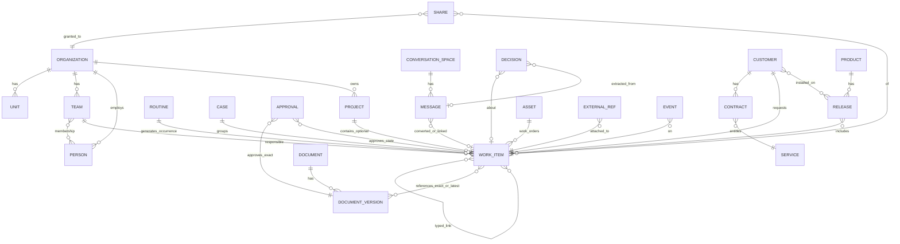

# مدل دادهٔ مرکزی — پیش‌نویس اول

**وضعیت:** نسخهٔ ۱٫۰؛ سؤال‌های M1 تا M7 با D-37 تا D-43 بسته شد (وضعیت تفویضی، D-36). این سند طراحی محصول است، نه طراحی پایگاه داده؛ نام جدول، نوع فیلد و فناوری در آن نیست. هدف: همهٔ تصمیم‌های قطعی تا این لحظه (D-10، D-13، D-16، D-26، D-28، D-31، D-35) در یک تصویر بنشینند و تعارض‌هایشان پیدا شود.

## ۱. اصول

1. **هر شیء دقیقاً یک سازمان مالک دارد** (D-16). مالکیت مشترک وجود ندارد؛ اشتراک وجود دارد.
2. **کار بدون پروژه معتبر است** (PLT-17، L01). پروژه ظرف اختیاری و زمان‌دار است؛ سازمان و تیم ظرف اجباری‌اند.
3. **سه شکل کار، یک ریشهٔ مشترک** (D-35). کار، پرونده و روال از یک «آیتم کاری» مشتق می‌شوند تا کامنت، تأیید، سند، پیوند و اعلان یک‌بار ساخته شود و برای هر سه کار کند.
4. **موتورهای مشترک، نه ماژول‌های تکراری** (بخش ۶ کاتالوگ): یک موتور تأیید، یک موتور سند، یک موتور گفتگو، یک موتور اعلان، یک موتور رابطه. هر بسته سیاست خودش را روی همان موتور می‌گذارد.
5. **نسخهٔ دقیق، نه «آخرین»** (DMS-08، DMS-14). هر اشاره به سند، تأیید یا تصمیم به نسخهٔ مشخص است؛ «پیوند به آخرین نسخهٔ معتبر» یک انتخاب صریح است.
6. **مرز محرمانگی تا سطح فیلد** (D-28). هر فیلد می‌تواند سیاست دید جدا داشته باشد؛ جست‌وجو، گزارش و AI همان سیاست را رعایت می‌کنند.
7. **رویداد قبل از وضعیت.** هر تغییر، یک رویداد با زمان، عامل و منبع است (INN-03، PLT-04). وضعیت فعلی از رویدادها ساخته می‌شود، نه برعکس. این پایهٔ «تازگی و پشتوانهٔ وضعیت» و لاگ ممیزی است.

## ۲. موجودیت‌ها

### الف. ظرف‌ها

| موجودیت | تعریف | یادداشت |
|---|---|---|
| **سازمان** | مرز مالکیت داده و مستأجر منطقی پلتفرم (D-10، D-15). | تیم مستقل = سازمان با یک تیم. |
| **واحد** | زیرمجموعهٔ سازمانی اختیاری (مالی، HR، فنی). | برای محرمانگی بین‌واحدی و گزارش کلان. |
| **تیم** | واحد انجام کار؛ اعضا، نقش‌ها، صف ورودی، روال‌ها. | یک شخص عضو چند تیم (L18). |
| **شخص** | هویت انسانی؛ عضو دقیقاً یک سازمان. | در سازمان دیگر «بیرونی» برچسب می‌خورد (D-16). |
| **پروژه** | ظرف زمان‌دار با شروع و پایان برای خروجی مشخص. | بستن پروژه چیزی را که به خدمت یا مشتری تعلق دارد نمی‌بندد (L05). |

### ب. آیتم کاری و سه شکل آن

| موجودیت | تعریف | مثال‌ها |
|---|---|---|
| **آیتم کاری** (ریشه) | هر چیزی که مسئول، وضعیت، موعد و سابقه دارد. | — |
| **کار** | آیتم تک با یک نتیجه. | تسک، باگ، دستورکار، درخواست ساده، زیرکار |
| **پرونده** | آیتم چندمرحله‌ای که با رویداد شروع و با نتیجه تمام می‌شود؛ چند کار، سند و تصمیم زیر خود دارد؛ ممکن است چند واحد در آن مشارکت کنند. | جذب نیرو، ورود و خروج نیرو، تیکت پیچیدهٔ مشتری، ادعای پیمانکاری، درخواست خرید تا تأمین |
| **روال** | الگوی نسخه‌دار که با تقویم «نوبت» تولید می‌کند؛ هر نوبت خودش یک کار یا پرونده است. | بستن ماه، چک روزانهٔ تجهیز، بازبینی دوره‌ای سند، تمدید مجوز |
| **نوع** | تعریف سفارشی یک شکل کار برای یک تیم: فیلدها، مراحل، انتقال‌های مجاز، شرط تکمیل (WRK-01، PLT-01). | «باگ» در T1، «دستورکار» در T2، «درخواست مرخصی» در T5 |

هر آیتم کاری: مالک (سازمان)، تیم مسئول، مسئول (شخص)، درخواست‌کننده (شخص یا مشتری)، نوع، وضعیت محلی + **وضعیت عمومی نگاشت‌شده** (باز، در جریان، منتظر، انجام‌شده، پذیرفته‌شده، لغو) برای گزارش کلان (بخش ۶ کاتالوگ)، موعد، پروژهٔ اختیاری، والد اختیاری.

### پ. موجودیت‌های چرخهٔ کامل (PLT-17)

| موجودیت | چرخهٔ عمر مستقل از پروژه | رابطهٔ کلیدی |
|---|---|---|
| **محصول** | ایده، نسخه‌ها، استفاده، بازنشستگی | چند پروژه آن را می‌سازند؛ نسخه‌های آن |
| **نسخه** | بستهٔ قابل‌تحویل با فهرست اجزا و تغییرات (REL-06) | به کارهای انجام‌شده، تیکت‌های بسته‌شده و مشتریان نصب‌شده وصل است |
| **خدمت** | عرضه، سطح خدمت، پشتیبانی | مالک، تیم پاسخ‌گو، مشتریان، دارایی‌ها |
| **مشتری** | سازمان بیرونی (CRM-01 فقط به‌عنوان موجودیت، D-23) | قراردادها، پرونده‌ها، تیکت‌ها، نسخهٔ نصب‌شده |
| **قرارداد / تعهد** | حق دریافت خدمت، SLA، سررسید (SUP-03، OPS-02) | مشتری یا تأمین‌کننده، خدمت، سند اصلی |
| **دارایی / تجهیز** | تأمین، نصب، تعمیر، خروج (DOM-03 حداقلی) | دستورکارها، اسناد، محل، مشتری یا سایت |
| **وضعیت نصب‌شده** | «این مشتری/سایت روی این نسخه/پیکربندی است» (OPS-06) | مشتری × نسخه × دارایی |

### ت. موتورهای مشترک

| موتور | موجودیت‌ها | به چه چیزی می‌چسبد |
|---|---|---|
| **سند** (DOC-01) | سند (شناسنامهٔ پایدار)، **نسخهٔ سند**، پیوند سند | هر آیتم کاری، پروژه، محصول، دارایی، قرارداد. پیوند یا «به نسخهٔ ثابت» است یا «به آخرین معتبر» (DMS-14). |
| **تأیید** (COL-03) | درخواست تأیید، گام (ترتیبی/موازی/حدنصاب)، رأی با دلیل، جانشین | همیشه به **نسخهٔ مشخص** یک موضوع: نسخهٔ سند، آیتم کاری در وضعیت معین، تغییر، تایم‌شیت. |
| **گفتگو** (COL-01، COL-08، D-26) | فضا (کانال، گروه، پیام مستقیم، رشتهٔ روی آیتم)، پیام، رشته | هر پیام می‌تواند به آیتم کاری، سند یا تصمیم «تبدیل» یا «پیوند» شود با لینک دوطرفه. |
| **تصمیم** (COL-02) | تصمیم: گزینه‌ها، دلیل، تصمیم‌گیر، تاریخ، موعد بازبینی | به آیتم کاری، پروژه، سند یا جلسه؛ از گفتگو استخراج می‌شود. |
| **سؤال و تعهد پاسخ** (COL-06، COL-07) | سؤال: پاسخ‌دهنده، موعد، وضعیت پاسخ | روی هر آیتم یا سند؛ «مانع» فقط با رابطهٔ صریح. |
| **اعلان** (COL-05) | اعلان، کانال تحویل (داخل محصول، ایمیل، پیامک، **ربات بله/ایتا/تلگرام** D-31، D-32)، تحویل و خواندن | هر رویداد. |
| **ورود از بیرون** (D-31) | کانال ورودی (گروه پیام‌رسان، ایمیل، فرم عمومی)، نگاشت طرف بیرونی → مشتری/شخص، رشتهٔ دوطرفه | پیام بیرونی → آیتم کاری؛ پاسخ داخلی → همان کانال. |
| **رابطه** (WRK-02) | پیوند تایپ‌دار: زیرمجموعه، وابسته‌به، مانع، تکراریِ، مرتبط‌با، ناشی‌از | بین هر دو آیتم کاری، و آیتم با سند/نسخه/دارایی. |
| **رویداد و سابقه** (PLT-04، INN-03) | رویداد: زمان، عامل، منبع (دستی، اتصال، ربات، خودکار)، تغییر | همه‌چیز. |
| **اتصال بیرونی** (PLT-05، D-20، D-33) | مرجع بیرونی: سامانه، شناسهٔ بیرونی، وضعیت، زمان همگام‌سازی | Git (commit/MR)، اتوماسیون اداری (شمارهٔ نامه)، CRM (فرصت برنده)، انبار (وضعیت قطعه)، حقوق/حسابداری (شماره و وضعیت). |

## ۳. مالکیت، دسترسی و اشتراک

| مفهوم | قاعده |
|---|---|
| مالک | هر شیء → یک سازمان. تغییرناپذیر مگر با «انتقال مالکیت» که رویداد ثبت‌شده است. |
| دید درون سازمان | نقش × واحد × تیم × سیاست فیلد (D-28). پیش‌فرض: عضو تیم، آیتم‌های تیم را می‌بیند؛ فیلد محرمانه (حقوق، متن مصاحبه، قیمت) فقط با نقش صریح. |
| اشتراک بین‌سازمانی (D-16) | «اشتراک» = شیء مشخص + سازمان گیرنده + سطح (مشاهده، کامنت، ویرایش، تأیید) + مالک اشتراک + تاریخ. زیرمجموعهٔ شیء به‌طور پیش‌فرض ارث می‌برد؛ استثنا قابل‌تعریف. لغو، سابقهٔ هر طرف را حفظ می‌کند. |
| مهمان (D-18) | شخصی بیرون از هر سازمان روی پلتفرم؛ فقط اشیاء صریحاً اشتراک‌شده را می‌بیند؛ همان مکانیزم اشتراک، با گیرندهٔ «شخص» به‌جای «سازمان». |
| جست‌وجو، گزارش، AI | همان ماتریس دید را رعایت می‌کنند؛ گزارش تجمیعی روی فیلد محرمانه فقط با همان نقش. |

## ۴. نمودار روابط (سطح مفهومی)

## ۵. تعارض‌ها و سؤال‌های طراحی که این مدل بیرون می‌آورد

همه با پیشنهاد ستون آخر بسته شدند: M1=D-37، M2=D-38، M3=D-39، M4=D-40، M5=D-41، M6=D-42، M7=D-43.

| # | سؤال | گزینه‌ها | پیشنهاد |
|---|---|---|---|
| M1 | «درخواست» یک شکل چهارم است یا حالتی از کار؟ | شکل جدا / کار با نوع «درخواست» و درخواست‌کنندهٔ بیرونی | کار با فیلد درخواست‌کننده؛ اگر چندمرحله‌ای شد، به پرونده ارتقا می‌یابد با حفظ سابقه (L02). |
| M2 | تیکت مشتری (WRK-06) چیست؟ | نوع کار / پرونده | نوع کار با درخواست‌کنندهٔ «مشتری» و SLA؛ تیکت پیچیده → پرونده. |
| M3 | پروژه خودش آیتم کاری است؟ | بله (پروژه = کار بزرگ) / نه (ظرف جدا) | ظرف جدا؛ ولی «مایلستون» و «تحویل» آیتم کاری‌اند. مانع تکرار منطق نمی‌شود چون کامنت و سند روی پروژه هم از موتور مشترک می‌آید. |
| M4 | مشتری که خودش روی پلتفرم است | یک موجودیت «مشتری» + پیوند به «سازمان» روی پلتفرم | مشتری همیشه موجودیت داخلی ماست؛ اگر آن سازمان روی پلتفرم باشد، پیوند دارد و اشتراک مستقیم ممکن می‌شود (D-16). این ریسک دوگانگی با CRM بیرونی (T6 A8) را هم پوشش می‌دهد: CRM بیرونی «مرجع» است، ما «آینه». |
| M5 | نسخهٔ سند در برابر نسخهٔ محصول | دو مفهوم جدا با نام متفاوت در رابط | «بازنگری» برای سند، «نسخه» برای محصول؛ در مدل دو موجودیت. |
| M6 | تأیید در پیام‌رسان بیرونی (D-31، D-32) | تأیید واقعی از ربات / فقط اعلان و لینک | تأیید واقعی از ربات با احراز هویت شمارهٔ متصل، ثبت به‌عنوان رأی در موتور تأیید با منبع «ربات بله». سیاست هر سازمان می‌تواند آن را ببندد. |
| M7 | فیلد محرمانه در گزارش تجمیعی | حذف ردیف / حذف فیلد / اجازه با نقش | اجازه فقط با نقش؛ در غیر آن فیلد حذف و ردیف می‌ماند تا شمارش درست بماند. |

## ۶. ارتباط با پرسش‌های معماری کاتالوگ (L01 تا L19)

این مدل به L01، L02، L04، L05، L06، L07، L09، L10، L11، L16، L18 و L19 پاسخ ساختاری می‌دهد. L03 (ردیابی نیاز تا پذیرش)، L08 (سه تصمیم جدا در رخداد)، L12 (بار پشتیبانی در ظرفیت)، L13 (تغییر سند → بازبینی آموزش)، L14 (نتیجهٔ عمل خودکار)، L15 (خاتمهٔ خدمت) و L17 (مالی و HR عضو کامل) به لایهٔ حرفه‌ای و بسته‌ها وابسته‌اند و در این پیش‌نویس فقط با موتور «رابطه» و «رویداد» پشتیبانی شده‌اند، نه با موجودیت جدا.
